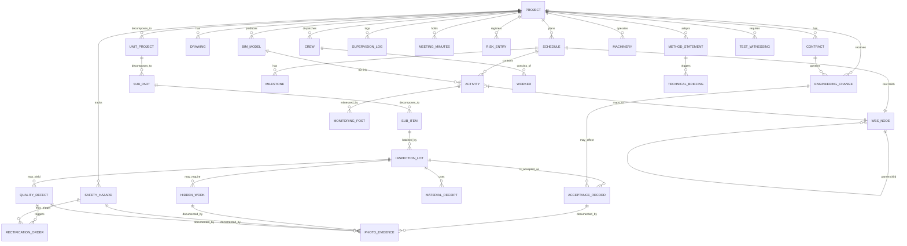

# construction_management · CORE · KEY-ENTITIES

30 个核心领域实体 · 对应 `csr.*` 表的主要部分 (48 表里关键的 30 个)。
本文件是领域建模的根 · prompt / schema / SDK 生成 · 都以本表为源。

---

## 1. 实体全表 (按子域分组)

| # | ID | 中文 | EN | 子域 | 表 | 核心字段 |
|---|---|---|---|---|---|---|
| 1 | `project` | 项目 | Project | root | `public.projects` | `id · tenant_id · name · current_module_id · area_sqm · budget_cny` |
| 2 | `contract` | 施工合同 | Contract | root | `csr.contracts` | `id · project_id · contract_no · total_amount_cny · signed_at` |
| 3 | `bim_model` | BIM 模型 | BIM Model | 10 | `csr.bim_models` | `id · project_id · version · ifc_uri · lod · published_at` |
| 4 | `drawing` | 施工图 | Drawing | root | `csr.drawings` | `id · project_id · sheet_no · discipline · revision · pdf_uri` |
| 5 | `schedule` | 进度计划 | Schedule | 01 | `csr.schedules` | `id · project_id · baseline_at · is_baseline` |
| 6 | `activity` | 工序 | Activity | 01 | `csr.activities` | `id · schedule_id · wbs_id · early_start · early_finish · duration_days` |
| 7 | `milestone` | 里程碑 | Milestone | 01 | `csr.milestones` | `id · project_id · target_at · status` |
| 8 | `wbs_node` | WBS 节点 | WBS Node | 01 | `csr.wbs_nodes` | `id · parent_id · code · name · level` |
| 9 | `crew` | 班组 | Crew | 03 / 04 | `csr.crews` | `id · project_id · name · craft · leader_worker_id` |
| 10 | `worker` | 作业人员 | Worker | 03 | `csr.workers` | `id · crew_id · id_no · craft · certifications` |
| 11 | `machinery` | 机械设备 | Machinery | 03 | `csr.machineries` | `id · project_id · type · reg_no · inspection_valid_until` |
| 12 | `material_receipt` | 材料进场验收 | Material Receipt | 02 | `csr.material_receipts` | `id · project_id · material_code · batch_no · qty · test_result` |
| 13 | `inspection_lot` | 检验批 | Inspection Lot | 07 | `csr.inspection_lots` | `id · sub_item_id · batch_no · main_items · general_items · verdict` |
| 14 | `sub_item` | 分项工程 | Sub Item | 07 | `csr.sub_items` | `id · sub_part_id · name · verdict` |
| 15 | `sub_part` | 分部工程 | Sub Part | 07 | `csr.sub_parts` | `id · unit_project_id · name · verdict` |
| 16 | `unit_project` | 单位工程 | Unit Project | 08 | `csr.unit_projects` | `id · project_id · name · verdict · accepted_at` |
| 17 | `acceptance_record` | 验收记录 | Acceptance Record | 08 | `csr.acceptance_records` | `id · target_type · target_id · level · verdict · evidence_uri` |
| 18 | `hidden_work` | 隐蔽工程记录 | Hidden Work | 08 | `csr.hidden_works` | `id · inspection_lot_id · before_buried_at · verdict` |
| 19 | `photo_evidence` | 影像留痕 | Photo Evidence | 全部 | `csr.photo_evidences` | `id · ref_type · ref_id · exif · gps · hash · uri` |
| 20 | `quality_defect` | 质量缺陷 | Quality Defect | 02 | `csr.quality_defects` | `id · inspection_lot_id · severity · description · photo_ids` |
| 21 | `rectification_order` | 整改通知单 | Rectification Order | 02 | `csr.rectification_orders` | `id · defect_id · form_code (A5) · deadline · status` |
| 22 | `safety_hazard` | 安全隐患 | Safety Hazard | 03 | `csr.safety_hazards` | `id · project_id · severity · location · photo_ids · closed_at` |
| 23 | `supervision_log` | 监理日志 | Supervision Log | 04 | `csr.supervision_logs` | `id · project_id · log_date · body · patrol_count · rectification_count` |
| 24 | `monitoring_post` | 旁站记录 | Monitoring Post | 04 | `csr.monitoring_posts` | `id · activity_id · start_at · end_at · witness_worker_id · findings` |
| 25 | `meeting_minutes` | 监理例会纪要 | Meeting Minutes | 04 | `csr.meeting_minutes` | `id · project_id · held_at · attendees · decisions` |
| 26 | `engineering_change` | 工程变更 | Engineering Change | 12 | `csr.engineering_changes` | `id · project_id · rfc_no · initiator · impact_cost_cny · impact_days · status` |
| 27 | `technical_briefing` | 技术交底 | Technical Briefing | 05 | `csr.technical_briefings` | `id · project_id · level · giver · receiver · topic · signed_at` |
| 28 | `method_statement` | 专项施工方案 | Method Statement | 05 | `csr.method_statements` | `id · project_id · scope · is_super_scale · expert_reviewed_at` |
| 29 | `test_witnessing` | 见证取样 | Test Witnessing | 06 | `csr.test_witnessings` | `id · project_id · sample_type · sampling_at · lab · report_no` |
| 30 | `risk_entry` | 风险登记 | Risk Entry | 09 | `csr.risk_entries` | `id · project_id · hazard · likelihood · exposure · consequence · lec_score` |

---

## 2. Mermaid ER 图



---

## 3. 关键关系约束

### 3.1 验收树 · 4 级强制嵌套
```
unit_project (1) ── sub_part (N) ── sub_item (N) ── inspection_lot (N)
```
- 任何验收记录 · `target_type` ∈ {unit_project, sub_part, sub_item, inspection_lot}
- 上级 `verdict = accepted` · 必须下级全部 `accepted` (事务里校验)

### 3.2 整改闭环
```
quality_defect ─ N:1 ─ rectification_order ─ 1:1 ─ photo_evidence (整改后)
safety_hazard  ─ N:1 ─ rectification_order ─ 1:1 ─ photo_evidence (整改后)
```
- `rectification_order.status = closed` · 必须有整改后的 photo_evidence 关联

### 3.3 影像留痕强制
- `hidden_work` · `acceptance_record (level = unit_project)` · `safety_hazard (severity ≥ major)` · 各至少 1 张 photo_evidence (数据库 trigger 强制)
- `photo_evidence.hash` · SHA-256 防篡改

### 3.4 班组作业人员一对多 · 不跨项目
- `worker.crew_id` → `crew.project_id` 间接绑定一个项目
- 跨项目调动 · 两条记录 · 不共用一条 worker (简化审计)

### 3.5 旁站覆盖关键工序
- `monitoring_post.activity_id` · 必须 `activity.is_key_process = true`
- 关键工序定义 · `standard_library` 提供清单 (混凝土浇筑 · 大体积 · 焊接 · 吊装 · 防水)

---

## 4. 跨模块引用

本模块 30 实体 · 与其它 13 模块的交互点:

| 本模块实体 | 对端模块 | 对端实体 | 关系 |
|---|---|---|---|
| `bim_model` | `detailed_design` | `bim_models` (main) | 1:1 · 本模块只镜像不主写 |
| `drawing` | `detailed_design` | `drawings` (main) | 1:1 |
| `contract` | `marketing_service` | `quotes_final` | 1:1 · 中标后落成本模块合同 |
| `material_receipt` | `material_logistics` | `shipments` | N:1 |
| `material_receipt` | `production_manufacturing` | `work_orders` | N:1 (预制件) |
| `material_receipt` | `standard_library` | `material_catalog` | N:1 (查材料规格) |
| `inspection_lot` | `standard_library` | `code_clauses` | N:N (主控项目引标准) |
| `engineering_change` | `quantity_costing` | `boq_items` | N:N (变更影响) |
| `acceptance_record (unit_project)` | `digital_twin` | `twin_models` | 1:1 (竣工模型移交) |
| `acceptance_record (unit_project)` | `digital_archive` | `archive_packages` | 1:1 (归档包) |

---

## 5. 不变量 (Invariants)

- **I-1**: 任何 `acceptance_record.verdict = accepted` · 必须至少引用 1 个 `standard_code` + `clause_no`
- **I-2**: `inspection_lot` 的 `main_items` 数组里每项必须 `verdict = pass` 才能整批 `verdict = pass`
- **I-3**: `engineering_change.status = approved` · 必须 `approved_by_owner IS NOT NULL`
- **I-4**: `method_statement.is_super_scale = true` · 必须 `expert_reviewed_at IS NOT NULL`
- **I-5**: `technical_briefing` 必须先 `method_statement` 审批后再下发
- **I-6**: `rectification_order.deadline` · 默认合理值按 `severity`:minor 3 天 · major 1 天 · critical 当天
- **I-7**: `supervision_log` 每项目每天最多 1 条 (unique `(project_id, log_date)`)
- **I-8**: `photo_evidence.hash` · 全表 unique · 防止重复关联伪造留痕

---

## 6. Stage 2 演进项

- 为每个实体补 · 实体事件 (Project Lifecycle Events) · 对应 pgmq 消息
- 为每个实体补 · `rules.md` · 描述 validation / authorization rules
- 30 实体最终落 30 个 `shared` crate 里的 Rust `struct`(暂用 `HashMap<String, Value>` 做桥)

---

version: 0.1.0 · 2026-04-23
