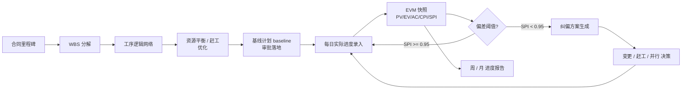

# SUBDOMAIN · 01-progress · 进度管理

> 施工管理"三控"的 **进度控制** 维度。
> 从施工组织设计审批到每日前锋线全过程 · 对接 BIM 4D 与 quantity_costing 5D。

---

## 1. 定位

进度管理是"三控两管一协调"里最定量的一环。输入是合同里程碑、BIM 模型、WBS 与资源;输出是
可执行的进度计划、每日 EVM 快照、纠偏建议与变更影响评估。

与其它子域的关系:
- ← **02-quality / 03-safety**:整改 / 隐患 导致的工期拖延,是进度偏差的常见根因
- ← **12-change_order**:设计变更 / 签证 必然触发进度影响评估
- → **04-daily_log**:日报汇总进度数据
- → **digital_twin**(跨模块):实时进度流数据

## 2. 核心实体

对应 `KEY-ENTITIES.md` 的实体 · 本子域拥有 4 个:

| 实体 | 表 | 说明 |
|---|---|---|
| `schedule` | `csr.schedules` | 进度计划主表 · 含 baseline / current 两状态 |
| `wbs_node` | `csr.wbs_nodes` | WBS 工作分解结构 · 邻接表 · parent_id 自引用 |
| `activity` | `csr.activities` | 工序 · 对应 Primavera Task / MS Project Task |
| `milestone` | `csr.milestones` | 里程碑 · 合同关键节点 |
| `progress_snapshot` | `csr.progress_snapshots` | EVM 日 / 周快照 (PV/EV/AC/CPI/SPI) |

完整 DDL: [`DATA-MODEL.md`](./DATA-MODEL.md)

## 3. 主要标准 (本子域精确引用)

- **GB/T 50502-2009** 建筑施工组织设计规范 (WBS · 网络计划 · 资源平衡)
- **GB/T 50326-2017** 建设工程项目管理规范 (进度控制章节)
- **GB/T 13400.1-2012** 网络计划技术 第 1 部分: 常用术语
- **GB/T 13400.2-2009** 网络计划技术 第 2 部分: 标识法
- **PMBOK Guide 7th** (PMI 2021) · §Earned Value Management
- **ISO 21502:2020** Project management guidance (§7.6 Schedule)
- **AS 4817-2006** Project performance measurement using Earned Value (参考)

完整清单见模块顶层 [`../../STANDARDS.md`](../../STANDARDS.md)。

## 4. 业务场景(一句话)

> 监理工程师周五 17:30 · 看到本周 SPI = 0.87(慢了 13%) · 系统列出前 3 大拖延工序 · 自动生成纠偏方案
> 草稿 · 周一晨会 15 分钟敲定方案。

详细场景: [`examples/jinping_week6_recovery.md`](./examples/jinping_week6_recovery.md)

## 5. 关键业务流程

状态机与详细流程: [`WORKFLOW.md`](./WORKFLOW.md)

## 6. API 入口 (前端可直接调)

| Method | Path | 说明 |
|---|---|---|
| POST | `/v1/csr/progress/schedules` | 上传新进度计划 |
| POST | `/v1/csr/progress/schedules/{id}/baseline` | 锁定为基线 |
| GET | `/v1/csr/progress/schedules/{project_id}/active` | 取当前活动计划 |
| POST | `/v1/csr/progress/snapshots` | 推一次 EVM 快照 |
| GET | `/v1/csr/progress/snapshots/{project_id}?since=...` | 取时间范围快照 |
| POST | `/v1/csr/progress/recovery/analyze` | 触发纠偏分析 (planner → generator → evaluator) |
| GET | `/v1/csr/progress/wbs/{project_id}` | 拉 WBS 树 |
| PATCH | `/v1/csr/progress/activities/{id}` | 更新工序状态 / 实际日期 |

完整 OpenAPI 3.1 snippet: [`API.md`](./API.md)

## 7. 前端组件

- `<ScheduleGantt />` — 主力横道图(d3 + three.js 可选 4D)
- `<EVMDashboard />` — PV/EV/AC/CPI/SPI 实时面板
- `<RecoveryWizard />` — 纠偏向导(4 步:识别 → 方案候选 → 影响评估 → 审批)
- `<MilestoneTimeline />` — 合同里程碑时间轴

详见 [`UI-COMPONENTS.md`](./UI-COMPONENTS.md)

## 8. BIM 4D 集成点

- BIM 构件 GlobalId → activity_id 双向映射 (`csr.bim_to_wbs_links`)
- Navisworks TimeLiner / Synchro 4D 能导出 CSV 进本表
- 前端 `BIMViewer.tsx` 按日期切片高亮当日工序构件

详见 [`BIM-INTEGRATION.md`](./BIM-INTEGRATION.md)

## 9. Prompts (LangGraph 三角色 + 1 子域特定)

- `prompts/planner.md` — 从合同 + BIM 拆 WBS + 识别关键路径候选
- `prompts/generator.md` — 生成进度计划 / 纠偏方案 / 资源平衡
- `prompts/evaluator.md` — 评估计划可行性 · CPI/SPI 偏差根因 · 纠偏有效性
- `prompts/delay_root_cause_analyzer.md` — 进度偏差根因自动分析器(核心工具)

总览: [`PROMPTS.md`](./PROMPTS.md)

## 10. 不变量 (Runtime Invariants)

- I-1 · 每个 project 有且仅有 1 个 `schedule.is_baseline = TRUE` 的记录
- I-2 · `activity.early_start ≤ activity.late_start` · 写入前校验
- I-3 · `activity.actual_start IS NOT NULL AND actual_finish IS NULL` 表示"进行中"
- I-4 · `progress_snapshot` · (project_id, snapshot_date) 唯一
- I-5 · 基线一旦锁定 · 不允许直接 UPDATE · 只能 INSERT 新版本并标 active
- I-6 · WBS 邻接表禁止环路 · 写入时 CTE 递归检测

## 11. SLA (宪法 §8)

| 操作 | planner | generator | evaluator |
|---|---|---|---|
| WBS 分解 | 60s | 120s | 30s |
| 纠偏方案生成 | 60s | 240s | 120s |
| EVM 快照分析 | 30s | 60s | 30s |

## 12. 当前状态

Stage 2 · 核心文档完成 · prompts 可接 LangGraph · SQL schema 可直接 `sqlx migrate run`。
见 [`READINESS.md`](./READINESS.md) 上线准入与受控增强项。

---

version: 0.1.0 · 2026-04-23
