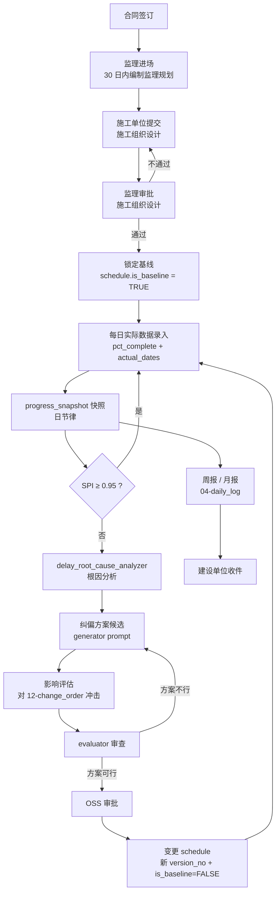
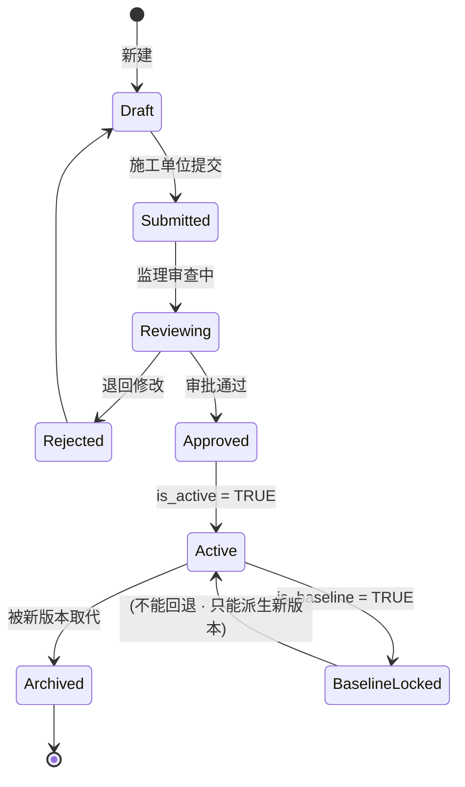
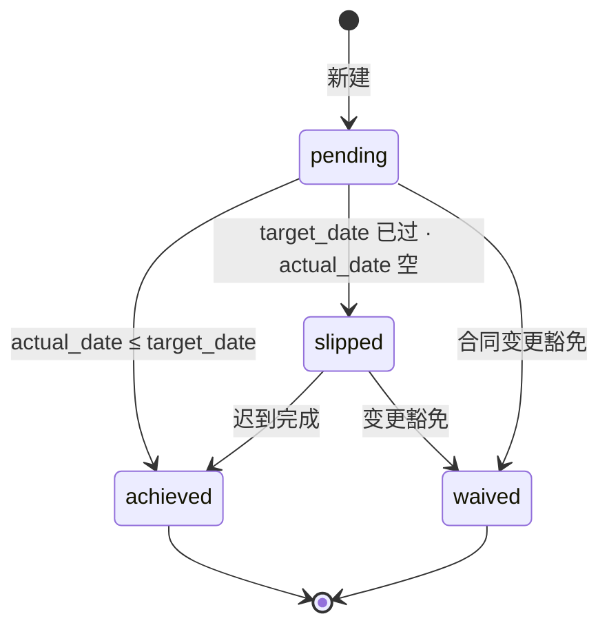

# 01-progress · WORKFLOW

进度控制业务流程 · mermaid 全景 + schedule 状态机 + RACI。

---

## 1. 全景流程

---

## 2. schedule 状态机

- Draft → Submitted · Owner/Contractor
- Submitted → Approved/Rejected · Supervisor 决策
- Approved → Active · 系统自动(替代之前 active)
- Active → BaselineLocked · Owner 确认后触发(每项目一次)
- 已 BaselineLocked 的 schedule · 不能改基线字段 · 只能由之产生新 version

## 3. milestone 状态机

`liquidated_damages_cny_per_day` 字段 · 当 milestone 进入 slipped 状态后 · 按日累计违约金候选额
(最终由合同仲裁决定)。

## 4. activity 状态 (派生自字段)

| 派生状态 | 规则 |
|---|---|
| `not_started` | `actual_start IS NULL AND pct_complete = 0` |
| `in_progress` | `actual_start IS NOT NULL AND actual_finish IS NULL` |
| `completed` | `actual_finish IS NOT NULL AND pct_complete = 100` |
| `delayed` | 当前日期 > `early_finish + total_float` AND `pct_complete < 100` |
| `paused` | 特殊标 (JSONB `meta.paused = true` · 不改 actual_*) |

## 5. RACI · 进度子域主要活动

| 活动 | Owner | Contractor | Supervisor | Designer |
|---|:-:|:-:|:-:|:-:|
| 施工组织设计编制 | I | **A/R** | C | C |
| 施工组织设计审批 | I | R | **A/R** | I |
| 基线进度计划锁定 | **A** | R | R | I |
| 日进度数据录入 | I | **A/R** | R (监督) | I |
| EVM 快照分析 | I | R | **A/R** | I |
| 纠偏方案生成 | I | **R** | **A** | C |
| 里程碑达成认定 | **A/R** | R | R | I |
| 违约金主张 | **A/R** | I | C | I |
| 关键路径变更审批 | **A** | R | R | C |

## 6. 与上下游子域的触发关系

- 03-safety 的 `safety_hazard.severity = critical` → 触发 `activity.paused`
- 02-quality 的 `rectification_order` 未闭环 → 下游 activity 的 `predecessors_json` 增加等待
- 12-change_order 批准的变更 → 生成新 schedule version
- 10-bim_integration 的 4D 模型 → 定期 sync 到 activities.bim_element_guids

---

version: 0.1.0 · 2026-04-23
