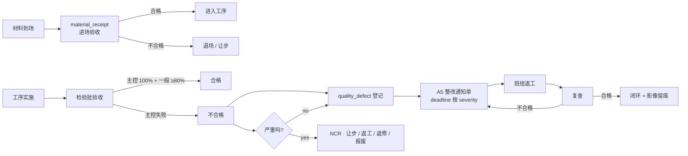

# SUBDOMAIN · 02-quality · 质量控制

> "三控"的 **质量控制** · PDCA 闭环 · 从材料进场到竣工缺陷全链路。

---

## 1. 定位

质量控制是监理现场工作的头等大事。输入是 BIM / 施工图 / 材料 / 强条;输出是进场验收记录、
缺陷登记、A5 整改通知单、NCR 报告与让步接收决议。

与其它子域:
- ← 07-inspection_lot: 检验批不合格 → 生成缺陷
- ← 06-testing: 实验室 / 现场检测结果 → 不合格 → 缺陷
- → 01-progress: 整改未闭环 → 工序延期
- → 11-compliance: 强条违反 → 阻断下游

## 2. 核心实体

| 实体 | 表 | 说明 |
|---|---|---|
| `quality_plan` | `csr.quality_plans` | 项目级质量计划 (QP) |
| `material_receipt` | `csr.material_receipts` | 材料进场验收 · 见证取样入口 |
| `quality_defect` | `csr.quality_defects` | 缺陷登记 |
| `rectification_order` | `csr.rectification_orders` | A5 整改通知单 · GB/T 50319 表 A.0.5 |
| `non_conformance_report` | `csr.non_conformance_reports` | NCR · ISO 9001:2015 §8.7 |

完整 DDL: [`DATA-MODEL.md`](./DATA-MODEL.md)

## 3. 主要标准

- **GB 50300-2013** 建筑工程施工质量验收统一标准 (根标准)
- **GB/T 50319-2013** 建设工程监理规范 §5.4 质量控制
- **ISO 9001:2015** §8.7 不合格输出控制
- **GB 50202 ~ GB 50210** 专业分部验收系列
- **GB 50204-2015** 混凝土结构工程施工质量验收规范
- **GB 50205-2020** 钢结构工程施工质量验收标准(锦屏项目核心)
- **JGJ/T 205-2010** 工程建设施工企业质量管理规范

## 4. 业务场景

> 5/19 10:15 · 监理见证 UT 抽检 3 点钢结构焊缝 · 1 点发现内部缺陷。
> 系统自动识别 · 生成缺陷登记 · 30 秒内出 A5 整改通知草稿 · 监理确认后签发。
> 班组 13:00 返工 · 14:30 复查合格 · 整改闭环 · 留痕 3 张照片 + 复检报告。

详细场景: [`examples/jinping_weld_rework.md`](./examples/jinping_weld_rework.md)

## 5. 关键业务流程

## 6. API 入口

| Method | Path | 说明 |
|---|---|---|
| POST | `/v1/csr/quality/plans` | 创建质量计划 |
| POST | `/v1/csr/quality/material-receipts` | 材料进场验收 |
| POST | `/v1/csr/quality/defects` | 登记缺陷 |
| POST | `/v1/csr/quality/defects/{id}/rectification` | 触发 A5 整改单生成 |
| POST | `/v1/csr/quality/defects/{id}/close` | 整改闭环 |
| POST | `/v1/csr/quality/ncr` | NCR 处置 |
| POST | `/v1/csr/quality/classify` | LLM 缺陷分类器(子域特定) |

详见 [`API.md`](./API.md)

## 7. 前端组件

- `<MaterialReceiptForm />` · 进场验收单
- `<DefectKanban />` · 缺陷看板(新建 / 整改中 / 复查 / 闭环)
- `<RectificationOrderA5 />` · A5 样式打印 / 签发
- `<QualityTrendDashboard />` · 缺陷趋势 / 合格率

## 8. Prompts

- `prompts/planner.md` · 质量任务规划
- `prompts/generator.md` · A5 整改单 / NCR 生成
- `prompts/evaluator.md` · 规范核查 · 闭环确认
- `prompts/defect_classifier.md` · 子域特定 · 缺陷分类器

## 9. 不变量

- I-1 · 主控项目不合格 → 整批 `verdict = fail` (不可配置)
- I-2 · `rectification_order.status = closed` 必须 ≥ 1 张整改后 photo_evidence
- I-3 · `material_receipt` 无合格报告 → 不允许被 inspection_lot 引用
- I-4 · NCR 处置 4 选 1 · 不能为空(rework | repair | concession | scrap)
- I-5 · deadline 自动:minor 3 日 · major 1 日 · critical 当日
- I-6 · 让步接收 (concession) 必须 designer.approved_at IS NOT NULL

## 10. SLA

| 操作 | planner | generator | evaluator |
|---|---|---|---|
| 缺陷登记 | 30s | 60s | 30s |
| A5 整改单生成 | 30s | 120s | 60s |
| NCR 处置建议 | 60s | 180s | 60s |
| 缺陷分类 | 10s | 30s | 10s |

## 11. 状态

Stage 2 · 完整骨架 · 5 张表 SQL 可运行 · 4 prompts 工程可用。

---

version: 0.1.0 · 2026-04-23
