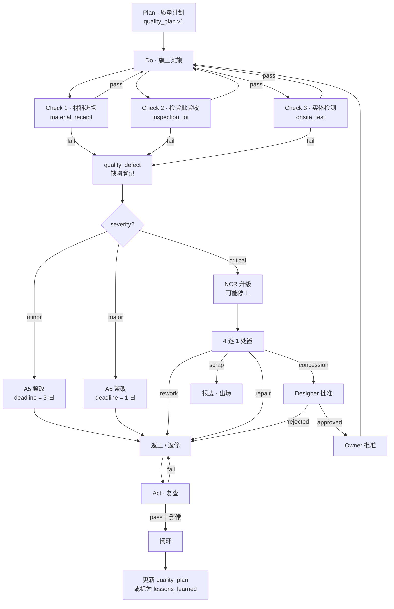
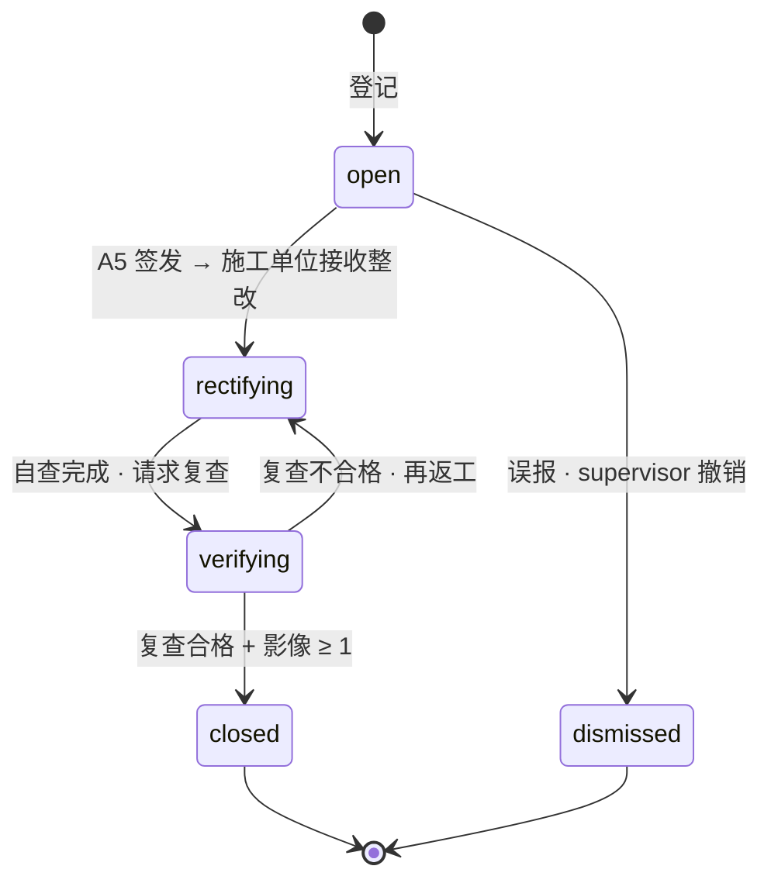
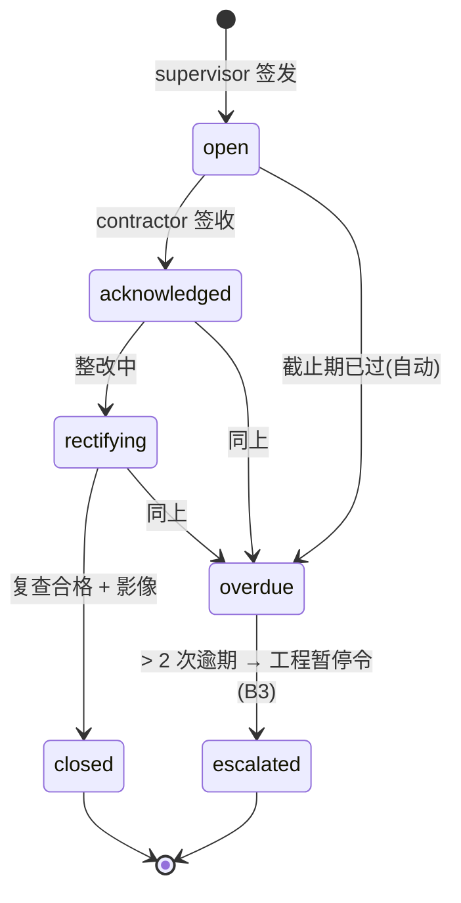
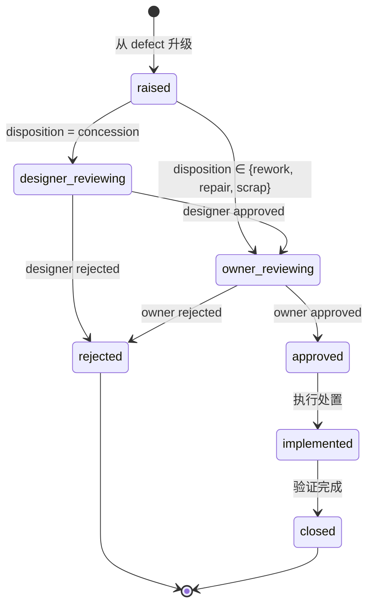

# 02-quality · WORKFLOW

质量控制业务流程 · mermaid + 状态机 + RACI。

---

## 1. 全景流程 (PDCA 闭环)

---

## 2. quality_defect 状态机

## 3. rectification_order 状态机

## 4. NCR (ISO 9001:2015 §8.7) 状态机

## 5. RACI

| 活动 | O | C | S | D |
|---|:-:|:-:|:-:|:-:|
| 质量计划编制 | I | **R** | **A** | C |
| 材料进场验收 | I | R | **A/R** | I |
| 见证取样 | I | R (取样) | **A/R** (见证) | I |
| 检验批验收 | I | **A/R** | R | I |
| 缺陷登记 | I | R | **A/R** | I |
| A5 整改签发 | I | I | **A/R** | I |
| 整改执行 | I | **A/R** | R (复查) | I |
| NCR 升级 | I | R | **A/R** | C |
| 让步接收批准 | **A** | R | R | **R** |
| 实体检测 | I | R | **A/R** | I |

## 6. 触发条件总览

| 事件 | 触发子域 |
|---|---|
| `quality_defect.severity = critical` 且 `open` 超 2 小时 | → 01-progress · activity.paused |
| `rectification_order.status = overdue` 累计 ≥ 2 条 | → 01-progress · 工期风险 + 03-safety 升级 |
| `material_receipt.verdict = fail` | → 12-change_order (材料变更) 或 material_logistics 换供 |
| `non_conformance_reports.disposition = concession approved` | → 11-compliance 留痕 |

---

version: 0.1.0 · 2026-04-23
