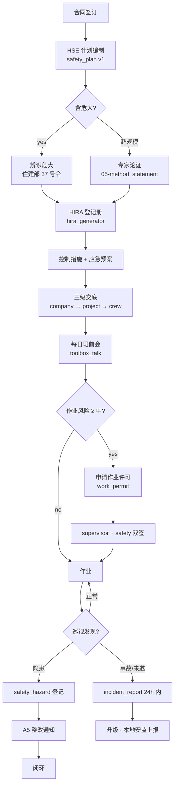
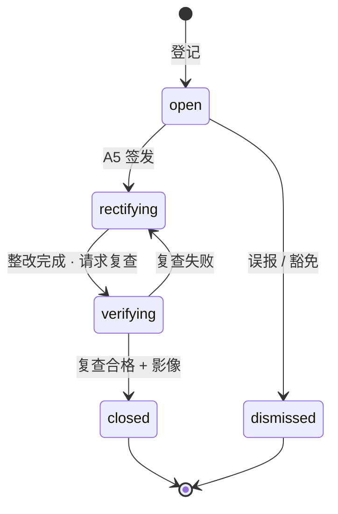
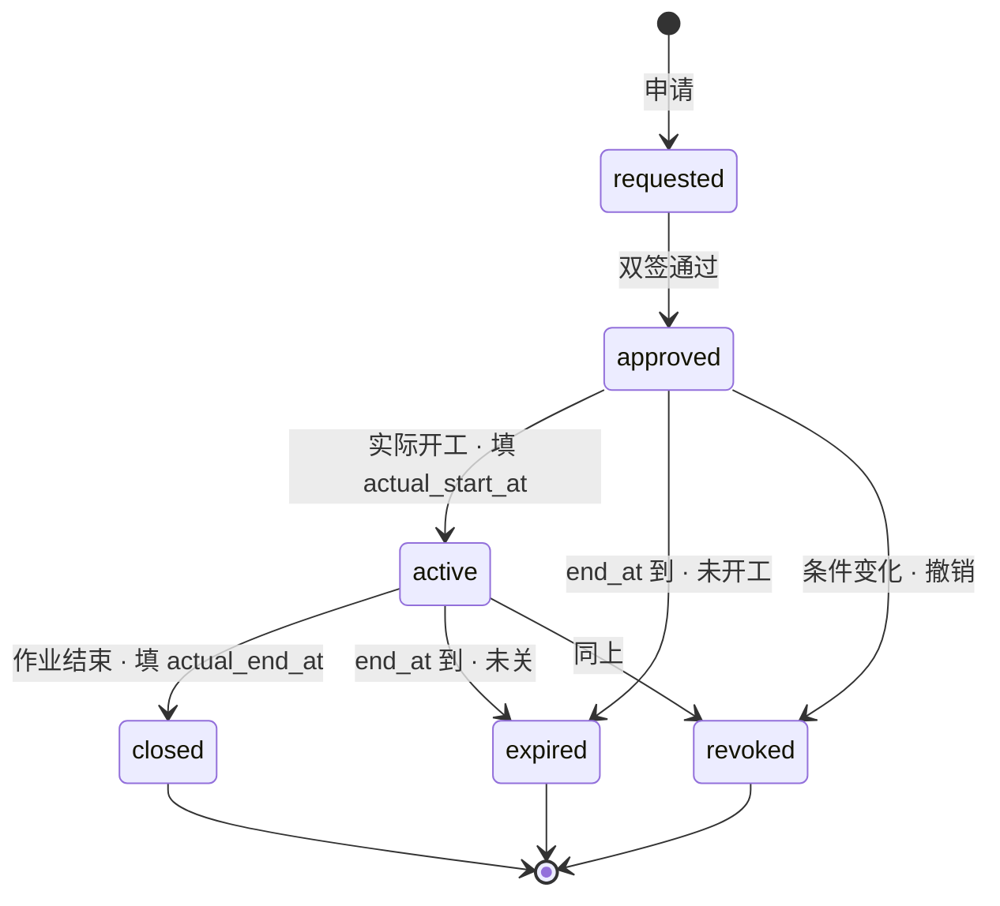
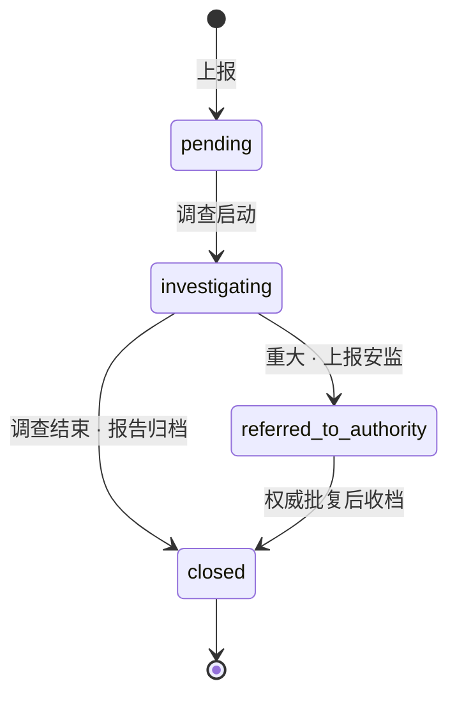

# 03-safety · WORKFLOW

安全控制流程 · mermaid + 状态机 + RACI。

---

## 1. 全景

## 2. hazard 状态机

## 3. work_permit 状态机

## 4. incident 状态机

## 5. RACI · 安全子域

| 活动 | O | C | S | SO(Safety Officer) | D |
|---|:-:|:-:|:-:|:-:|:-:|
| HSE 计划 | I | **R** | **A/R** | R | C |
| 危大辨识 | I | **R** | **A/R** | R | C |
| HIRA 生成 | I | R | **A/R** | **R** | I |
| 专项方案 | I | **R** | **A** | R | C |
| 专家论证 | I | **R** | **A** | C | C |
| 三级交底 | I | **A/R** | R (见证) | R | I |
| 作业许可双签 | I | R | **R** | **R** | I |
| 班前会 | I | **A/R** | C | R | I |
| 隐患整改 | I | **A/R** | **R** | R | I |
| 事故 24h 上报 | I | **A/R** | R | R | I |
| 工程暂停令 (B3) | I | I | **A/R** | I | I |

## 6. 跨子域触发

| 源 | 事件 | 目标 |
|---|---|---|
| 03-safety | hazard.severity = critical | → 01-progress · activity.paused |
| 03-safety | incident.severity = fatal | → 工程暂停令 · 全项目 |
| 03-safety | permit.expired 未关 | → supervision_log 违规记录 |
| 02-quality | defect 导致 · rework 现场 | → hazard 识别(动火 / 高处再评估) |
| 01-progress | 赶工方案 | → HIRA 重评估(资源叠加 · 风险升高) |

## 7. 危大工程清单(锦屏适用)

基于 建办质〔2018〕31 号 附件一 · 锦屏 520㎡ 重钢别墅项目:
- ✅ 起重吊装 (塔吊 · QTZ40 以上)
- ✅ 脚手架工程 (外立面作业 · 高度 ~9m)
- ❌ 深基坑 (基础埋深 < 3m · 非深)
- ❌ 高大模板 (模板高度 < 8m)
- ❌ 暗挖工程 / 爆破 / 建筑拆除 (本项目不涉及)

所以锦屏的危大清单 = 吊装 + 脚手架 · 两项专项方案需编。

---

version: 0.1.0 · 2026-04-23
