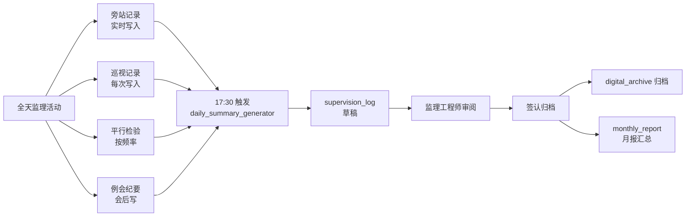

# SUBDOMAIN · 04-daily_log · 监理日志

> 监理日常工作的"黑匣子"· 日记 + 旁站 + 巡视 + 平行检验 + 例会纪要。

---

## 1. 定位

一切监理行为必须留痕:
- 每日 1 条日志(unique per project-date)
- 每关键工序 1+ 旁站记录
- 每日 ≥ 3 次巡视
- 按抽检频率平行检验
- 每周 / 每月 例会纪要

本子域是所有监理资料的真源 · 下游 `digital_archive` 归档由此取数。

## 2. 核心实体

| 实体 | 表 |
|---|---|
| `supervision_log` | `csr.supervision_logs` · 日志(主) |
| `monitoring_post` | `csr.monitoring_posts` · 旁站 |
| `patrol_record` | `csr.patrol_records` · 巡视 |
| `parallel_inspection` | `csr.parallel_inspections` · 平行检验 |
| `meeting_minutes` | `csr.meeting_minutes` · 例会纪要 |

## 3. 主要标准

- **GB/T 50319-2013** §3.4.2 监理日志 · §5.3 旁站 / 巡视 / 平行检验
- **GB/T 50319-2013** §5.5 监理月报 · §5.7 监理例会
- **JGJ/T 185-2009** 建筑工程资料管理规程 §4 监理资料

## 4. 业务场景

> 17:30 · 监理工程师打开"今日日志自动摘要"· AI 自动聚合全天 12 个 subdomain 的事件
> (9 巡视 / 2 旁站 / 1 平行检验 / 1 A5 / 1 班前会)· 5 分钟审阅 · 签认归档。

详见 [`examples/jinping_day7_log.md`](./examples/jinping_day7_log.md)

## 5. 关键流程

## 6. API

| Method | Path | 说明 |
|---|---|---|
| POST | `/v1/csr/daily-log/patrols` | 巡视记录 |
| POST | `/v1/csr/daily-log/monitoring-posts` | 旁站记录 |
| POST | `/v1/csr/daily-log/parallel-inspections` | 平行检验 |
| POST | `/v1/csr/daily-log/meetings` | 例会纪要 |
| POST | `/v1/csr/daily-log/daily-summary` | 触发日志汇总(LLM) |
| GET | `/v1/csr/daily-log/supervision-logs/{project_id}/{date}` | 查某日日志 |
| POST | `/v1/csr/daily-log/supervision-logs/{id}/sign` | 签认 |

## 7. 前端组件

- `<DailyLogTimeline />` · 全天活动时间轴
- `<PatrolQuickRecord />` · 移动端 · 一键巡视打卡(GPS + 照片)
- `<MonitoringPostActive />` · 旁站中的实时计时器
- `<MeetingMinuteForm />` · 会议录音转写 + AI 摘要
- `<DailyLogReviewer />` · 监理签认界面

## 8. Prompts

- `prompts/planner.md`
- `prompts/generator.md`
- `prompts/evaluator.md`
- `prompts/daily_summary_generator.md` · **核心** · 全天事件汇总成结构化日志

## 9. 不变量

- I-1 · (project_id, log_date) unique · 每日每项目最多 1 条日志
- I-2 · 旁站记录必须 `activity.is_key_process = TRUE`
- I-3 · 巡视记录必须有 GPS 或 2+ 照片(证明实地到过)
- I-4 · 例会 attendees 必须包含五方或说明缺席方
- I-5 · 日志 `signed_at IS NULL` · 不能归档到 digital_archive

## 10. SLA

| 操作 | planner | generator | evaluator |
|---|---|---|---|
| 日志汇总 | 30s | 120s | 30s |
| 月报生成 | 60s | 300s | 120s |
| 会议纪要 | 30s | 120s | 30s |

## 11. 状态

Stage 2 · 完整骨架 · 4 表 + 5 个日志实体(含 meeting_minutes)· 4 prompts · Day 7 场景。

---

version: 0.1.0 · 2026-04-23
