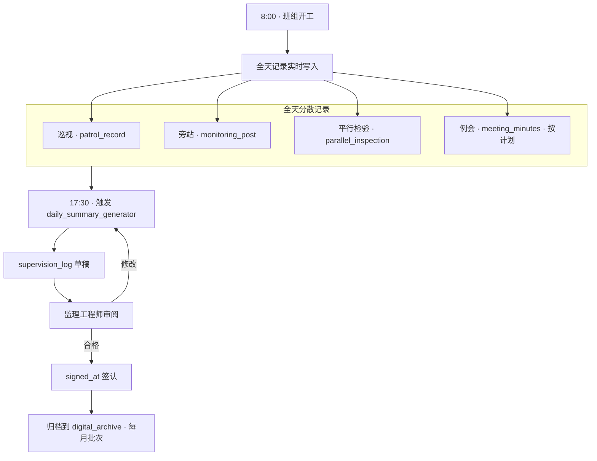
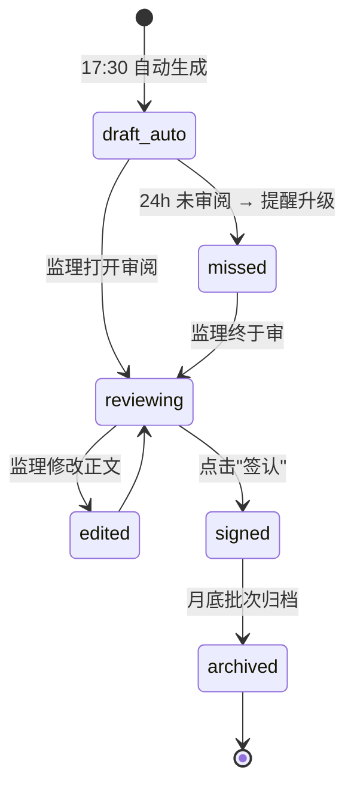
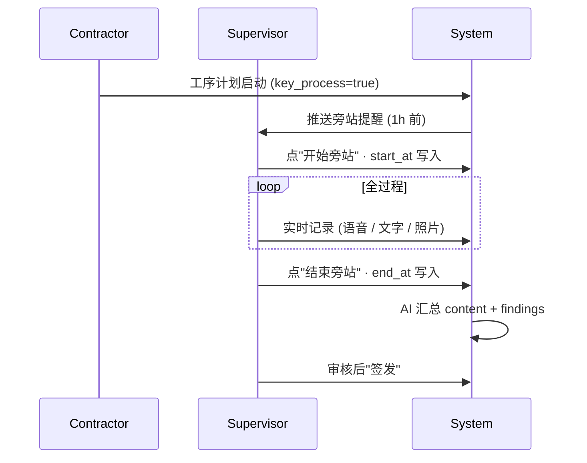

# 04-daily_log · WORKFLOW

---

## 1. 全景

## 2. 日志状态机

## 3. 旁站流程

## 4. RACI

| 活动 | O | C | S |
|---|:-:|:-:|:-:|
| 巡视 | I | I | **A/R** |
| 旁站 | I | C (配合) | **A/R** |
| 平行检验 | I | C | **A/R** |
| 监理日志 | I | I | **A/R** |
| 监理月报 | I | I | **A/R** |
| 例会主持 | C | C | **A/R** |
| 例会纪要 | I | I | **A/R** |

## 5. 自动触发

| 事件 | 触发 | 写入 |
|---|---|---|
| 02-quality 整改签发 | pgmq 消息 | supervision_log.key_events + rectification_issued++ |
| 02-quality 整改闭环 | 同 | rectification_closed++ |
| 03-safety 事故 / 作业许可 | 同 | supervision_log.key_events |
| 01-progress EVM 快照 | 同 | supervision_log.body 注入 SPI/CPI |
| 08-acceptance 验收 | 同 | key_events |

## 6. 月报生成

- 每月 26 日 23:00 触发 · 汇总前 28 天 supervision_logs
- 按 GB/T 50319-2013 §5.5 表 A.0.19 标准化输出
- 监理工程师审签后 · 发送五方

---

version: 0.1.0 · 2026-04-23
