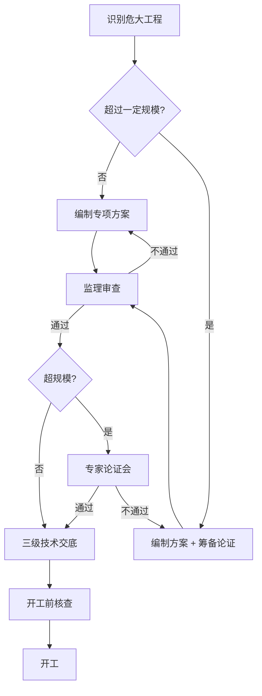

# SUBDOMAIN · 05-method_statement · 施工方案与技术交底

> 专项施工方案 + 危大工程专家论证 + 三级技术交底 · 开工前的"法律门槛"。

---

## 1. 定位

每个关键工序 / 危大工程 · 开工前必须:
1. 施工单位编制专项施工方案
2. 监理审查 · 审批或退回
3. 超过一定规模的危大 · 专家论证
4. 三级技术交底 · 公司 → 项目 → 班组

本子域记录从"方案起草"到"交底签认"的完整链路 · 任一环节缺失 · 03-safety 阻断开工。

## 2. 核心实体

| 实体 | 表 |
|---|---|
| `method_statement` | `csr.method_statements` · 专项方案 |
| `technical_briefing` | `csr.technical_briefings` · 技术交底 |
| `expert_review` | `csr.expert_reviews` · 危大专家论证 |

## 3. 主要标准

- **住建部令 第 37 号** 危险性较大的分部分项工程安全管理规定 (法源)
- **建办质〔2018〕31 号** 危大工程辨识清单
- **GB 50656-2011** 施工企业安全生产管理规范
- **GB/T 50319-2013** §5.2.2 施工组织设计 / 专项方案审批程序
- **GB 50870-2013** 施工安全统一规范

## 4. 业务场景

> 5/10 · 塔吊进场前 3 日 · 施工方提交"起重吊装专项方案"· 监理 4 小时内审完意见 · 退回 2 点修改。
> 5/12 · 方案通过 · 属超规模(单件 > 10t)· 邀请 5 位专家视频论证 · 5/13 论证通过。
> 5/14 · 三级交底齐 · 5/15 正式吊装。

详见 [`examples/jinping_lifting_ms.md`](./examples/jinping_lifting_ms.md)

## 5. 关键流程

## 6. API

| Method | Path | 说明 |
|---|---|---|
| POST | `/v1/csr/method-statement/ms` | 提交专项方案 |
| POST | `/v1/csr/method-statement/ms/{id}/review` | 监理审查 |
| POST | `/v1/csr/method-statement/expert-review` | 组织专家论证 |
| POST | `/v1/csr/method-statement/expert-review/{id}/finalize` | 论证结论 |
| POST | `/v1/csr/method-statement/briefings` | 技术交底记录 |
| POST | `/v1/csr/method-statement/expert-review-facilitate` | 子域特定 · 论证辅助 |

## 7. 前端组件

- `<MethodStatementUploader />` · 上传 PDF + 结构化元数据
- `<MsReviewPane />` · 审查面板 · markdown 评论
- `<ExpertReviewMeeting />` · 论证会界面 · 投票 + 录音
- `<BriefingForm />` · 三级交底表单 · 签字式

## 8. Prompts

- `prompts/planner.md`
- `prompts/generator.md` · 方案模板 / 交底要点 / 审查意见
- `prompts/evaluator.md`
- `prompts/expert_review_facilitator.md` · **核心** · 论证会议协调

## 9. 不变量

- I-1 · `is_super_scale = TRUE` AND `expert_reviewed_at IS NULL` · 禁止开工
- I-2 · 三级交底必须按 company → project → crew 顺序
- I-3 · 方案 PDF hash · 论证前后不可改(防偷换)
- I-4 · `expert_review.attendees_count ≥ 5` 且 相关专业 ≥ 3 人(住建部 37 号令要求)
- I-5 · 论证意见必须"通过" / "原则通过需修改" / "不通过" 三选 1

## 10. SLA

| 操作 | planner | generator | evaluator |
|---|---|---|---|
| 方案审查意见 | 60s | 180s | 60s |
| 论证筹备 | 30s | 120s | 30s |
| 交底生成 | 30s | 60s | 30s |
| 论证辅助 | 60s | 240s | 120s |

## 11. 状态

Stage 3 · 骨架完整 · 3 表 · 4 prompts · 锦屏吊装场景。

---

version: 0.1.0 · 2026-04-23
