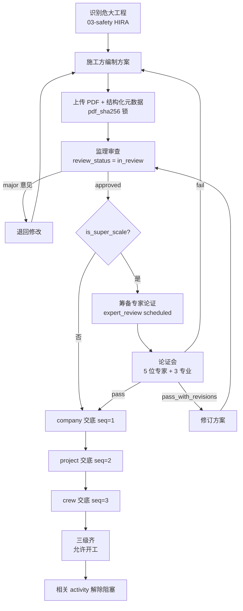
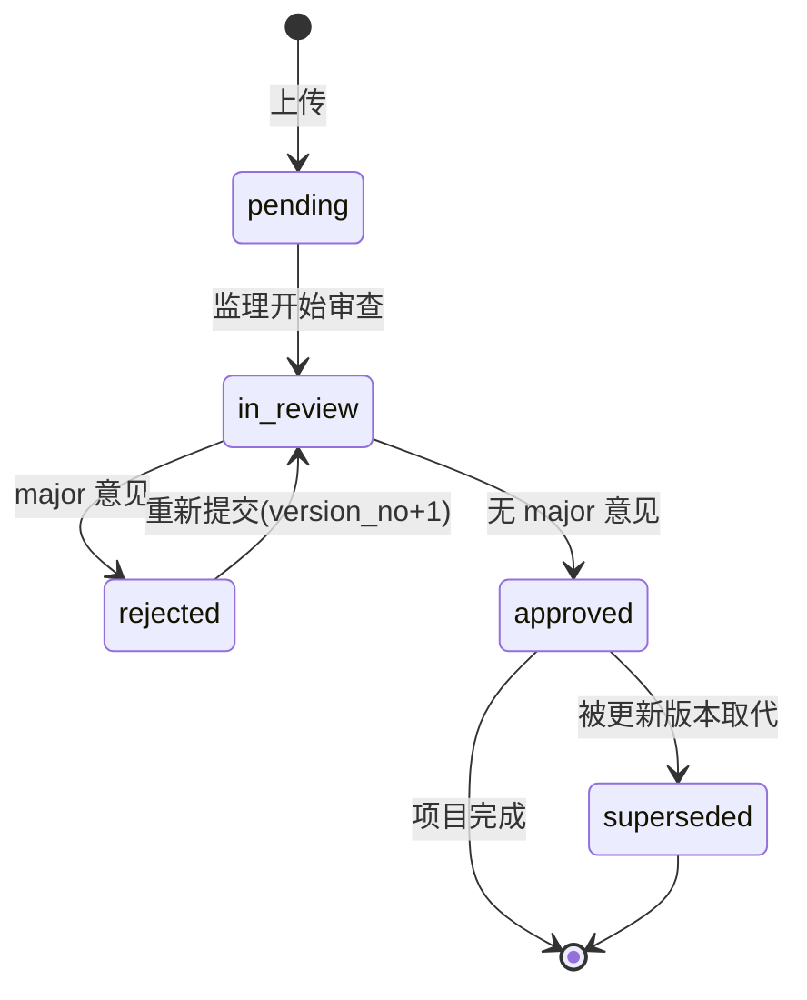
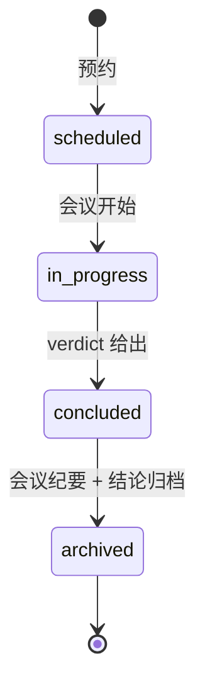

# 05-method_statement · WORKFLOW

---

## 1. 全景

## 2. method_statement 状态机

## 3. expert_review 状态机

## 4. RACI

| 活动 | O | C | S | SO | Expert |
|---|:-:|:-:|:-:|:-:|:-:|
| 方案编制 | I | **A/R** | C | C | - |
| 方案审查 | I | R | **A/R** | R | - |
| 邀请专家 | I | R (负担费用) | **A/R** | R | - |
| 专家论证 | I | R | R | R | **A/R** |
| 意见修订 | I | **A/R** | R | C | - |
| 三级交底 | I | **A/R** | R (见证) | R | - |
| 开工前核查 | I | R | **A/R** | R | - |

## 5. 触发关系

| 事件 | → |
|---|---|
| `03-safety.HIRA` 识别危大 | 本子域生成 MS 占位 |
| MS approved | 03-safety 允许发该类 work_permit |
| 三级交底齐 + MS approved | 01-progress 的 activity 解除阻塞(is_key_process 自动 TRUE) |
| MS rejected | 01-progress 的 activity 标 `blocked_by_ms = ms_id` |

---

version: 0.1.0 · 2026-04-23
