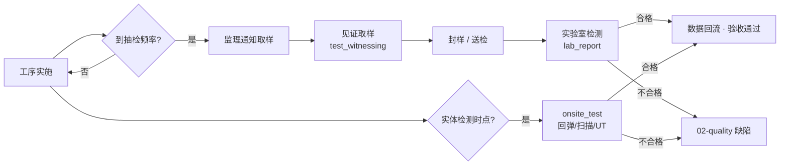

# SUBDOMAIN · 06-testing · 检测试验

> 见证取样 + 第三方 CMA 实验室 + 现场无损检测 · 所有验收的硬证据。

---

## 1. 定位

本子域负责 "数据硬证据" · 区别于 02-quality(问题管理)和 07-inspection_lot(验收评定)。
- 取样是验收前的"前置"
- 检测数据流入 02-quality 判定缺陷 · 流入 07-inspection_lot 判定主控/一般项
- 不合格即触发 02-quality 的 A5 整改流程

## 2. 核心实体

| 实体 | 表 |
|---|---|
| `test_witnessing` | `csr.test_witnessings` · 见证取样记录 |
| `lab_report` | `csr.lab_reports` · 实验室检测报告 |
| `onsite_test` | `csr.onsite_tests` · 现场无损/半损检测 |

## 3. 主要标准

- **GB 50204-2015** §7.2 混凝土 见证取样规定
- **GB 50205-2020** §7.2 钢结构 焊缝 UT / MT / RT / PT
- **GB/T 50784-2013** 混凝土结构现场检测技术标准
- **JGJ/T 23-2011** 回弹法检测混凝土抗压强度
- **GB/T 11345-2013** 焊缝 UT · **GB/T 9444-2019** MT · **GB/T 3323-2019** RT · **GB/T 18851.1-2012** PT
- **GB 50300-2013** 材料进场复检 / 实体检测 一般要求

## 4. 业务场景

> 5/19 10:00 · 监理见证取样 W-208 焊缝 UT 3 点 · CMA 实验室 JP-UT-2026-0013 报告 14:40 回传 · 自动关联到 02-quality 的 defect。

详见 [`examples/jinping_ut_witness.md`](./examples/jinping_ut_witness.md)

## 5. 关键流程

## 6. API

| Method | Path | 说明 |
|---|---|---|
| POST | `/v1/csr/testing/witnesses` | 见证取样登记 |
| POST | `/v1/csr/testing/lab-reports` | 实验室报告录入 |
| POST | `/v1/csr/testing/onsite-tests` | 现场检测 |
| POST | `/v1/csr/testing/sample-plan` | LLM 生成取样计划(子域特定) |
| GET | `/v1/csr/testing/by-lot/{inspection_lot_id}` | 关联检验批查询 |
| POST | `/v1/csr/testing/lab-reports/{id}/verify-cma` | CMA 资质核验 |

## 7. 前端组件

- `<WitnessForm />` · 取样单
- `<LabReportImport />` · 实验室 PDF 拖拽 + OCR 解析结构化
- `<OnsiteTestForm />` · 现场检测 · 支持仪器直连
- `<SamplePlanDashboard />` · 抽检进度看板

## 8. Prompts

- `prompts/planner.md`
- `prompts/generator.md` · 见证取样单 / 实体检测计划
- `prompts/evaluator.md`
- `prompts/sample_plan_generator.md` · **核心** · 按规范自动算取样频率与数量

## 9. 不变量

- I-1 · `test_witnessing` 必须有 witness_supervisor_id + sampler_contractor_id 双方签字
- I-2 · `lab_report.lab_cma_no` 必须有效(调 CMA 查验接口)· 过期报告不采
- I-3 · `onsite_test.equipment_calibration_valid = TRUE` · 仪器年检过期的数据不采
- I-4 · 不合格结果自动触发 `02-quality` INSERT defect(pgmq 消息)
- I-5 · 合格结果自动回传 `07-inspection_lot` 的主控项目判定

## 10. SLA

| 操作 | planner | generator | evaluator |
|---|---|---|---|
| 取样计划 | 60s | 180s | 60s |
| 见证单生成 | 30s | 60s | 30s |
| 报告解析 | 30s | 90s | 30s |

## 11. 状态

Stage 3 · 3 表 · 4 prompts · 锦屏焊缝 UT 场景。

---

version: 0.1.0 · 2026-04-23
