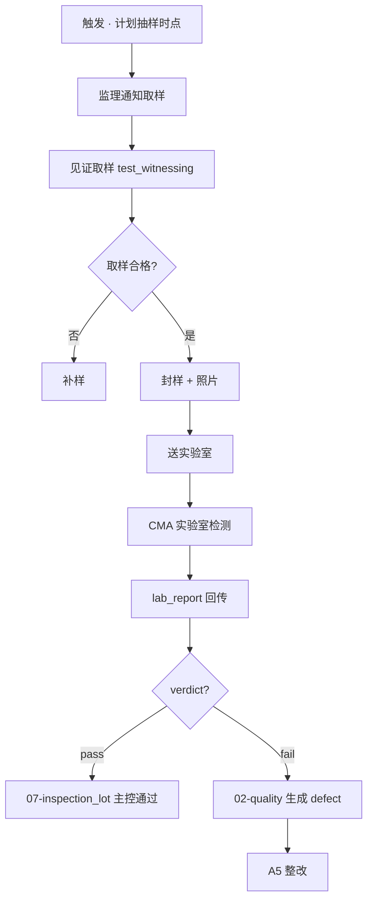
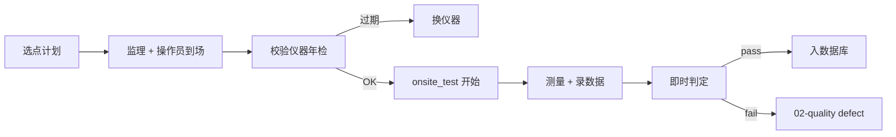

# 06-testing · WORKFLOW

---

## 1. 取样 + 送检全流程

## 2. 现场检测流程

## 3. RACI

| 活动 | O | C | S |
|---|:-:|:-:|:-:|
| 抽样计划 | I | R | **A/R** |
| 见证取样 | I | R (取样) | **A/R** (见证) |
| 送检 | I | **A/R** | R |
| CMA 查验 | I | I | **A/R** |
| 现场检测操作 | I | R (如自行) | **A/R** (见证 / 平行) |
| 不合格升级 | I | R | **A/R** |

## 4. 触发关系

| 事件 | → |
|---|---|
| `lab_report.verdict = 'fail'` | 02-quality INSERT defect + linked_defect_ids 回填 |
| `onsite_test.verdict = 'fail'` | 同 |
| `lab_report.verdict = 'pass'` | 07-inspection_lot 对应主控项标 passed |
| `onsite_test.equipment_calibration < tested_at` | 拒绝 INSERT(CHECK 约束) |

---

version: 0.1.0 · 2026-04-23
