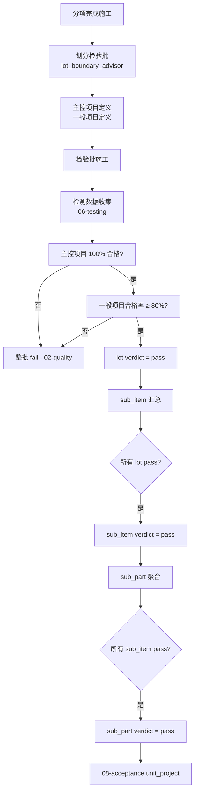

# SUBDOMAIN · 07-inspection_lot · 检验批

> GB 50300-2013 根基 · 四级验收树底层 · 最小验收单元。

---

## 1. 定位

`inspection_lot` 是 GB 50300-2013 里的最小验收单元。自下而上:
```
inspection_lot (N) → sub_item (1..N) → sub_part (1..N) → unit_project (1)
```

本子域管理:
- 按工程量 / 施工段划分检验批
- 主控项目 / 一般项目 的判定
- 合格率计算
- 逐级向上聚合验收结论

## 2. 核心实体

| 实体 | 表 |
|---|---|
| `inspection_lot` | `csr.inspection_lots` · 检验批 |
| `sub_item` | `csr.sub_items` · 分项工程 |
| `sub_part` | `csr.sub_parts` · 分部工程(含子分部) |

`unit_project` 在 08-acceptance 子域管。

## 3. 主要标准

- **GB 50300-2013** §4 分类 · §5 验收程序 · 表 B 格式
- **GB 50202-2018 ~ GB 50210-2018** 专业分部验收系列
- **GB 50204-2015** 混凝土 · **GB 50205-2020** 钢结构
- **GB 50411-2019** 节能
- **GB/T 50319-2013** 监理规范 §5.4

## 4. 业务场景

> 5/17 · 施工方完成二层钢结构梁柱节点焊接工序。
> 按施工段划检验批:二层 A 轴 / B 轴 / C 轴 三批。
> 每批主控项目 5 项 + 一般项目 12 项。
> A 轴批通过 · B 轴批主控 4 过 1 失(W-208 UT) · C 轴批待焊完。
> B 批 verdict = fail → 自动触发 02-quality 缺陷登记。

详见 [`examples/jinping_lot_b5.md`](./examples/jinping_lot_b5.md)

## 5. 关键流程



## 6. API

| Method | Path | 说明 |
|---|---|---|
| POST | `/v1/csr/inspection-lot/lots` | 创建检验批 |
| POST | `/v1/csr/inspection-lot/lots/{id}/evaluate` | 评定(主控 / 一般 · 生成 verdict) |
| POST | `/v1/csr/inspection-lot/lot-boundary-advisor` | LLM 建议划分(子域特定) |
| GET | `/v1/csr/inspection-lot/tree/{project_id}` | 四级验收树 |
| POST | `/v1/csr/inspection-lot/sub-items` | 分项工程 |
| POST | `/v1/csr/inspection-lot/sub-parts` | 分部工程 |
| POST | `/v1/csr/inspection-lot/rollup/{sub_part_id}` | 触发向上聚合 |

## 7. 前端组件

- `<AcceptanceTree />` · 四级树展开 · 状态色码
- `<LotDetailForm />` · 检验批编辑 + 评定
- `<MainControlChecklist />` · 主控项目清单 · 分项勾选
- `<GeneralItemProgress />` · 一般项目合格率进度条
- `<LotBoundaryAdvisorDialog />` · 划分建议向导

## 8. Prompts

- `prompts/planner.md`
- `prompts/generator.md` · 批划分 / 评定描述
- `prompts/evaluator.md`
- `prompts/lot_boundary_advisor.md` · **核心** · 按规范自动建议检验批划分

## 9. 不变量

- I-1 · `inspection_lot.main_items` 数组 · 任一 verdict=fail → 整批 fail(数据库级 CHECK)
- I-2 · `inspection_lot.general_items` 合格率 < 80% → 整批 fail
- I-3 · 子级全 pass 才能聚合到父级 · 否则父级保持 pending
- I-4 · verdict = accepted 必须引用 ≥ 1 个标准 · clause 不为空
- I-5 · 聚合后 · 下级任一翻案 · 上级自动回退 pending(trigger)

## 10. SLA

| 操作 | planner | generator | evaluator |
|---|---|---|---|
| 批划分建议 | 60s | 180s | 60s |
| 批评定 | 30s | 60s | 30s |
| 向上聚合 | 10s | 30s | 10s |

## 11. 状态

Stage 3 · 3 表 · 4 prompts · 锦屏 B5 批场景。

---

version: 0.1.0 · 2026-04-23
