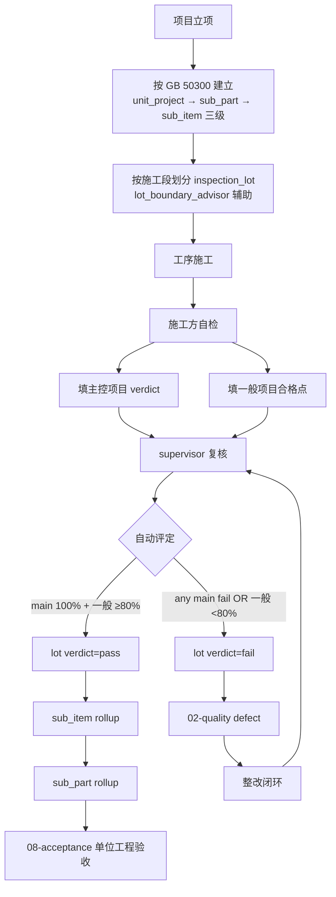
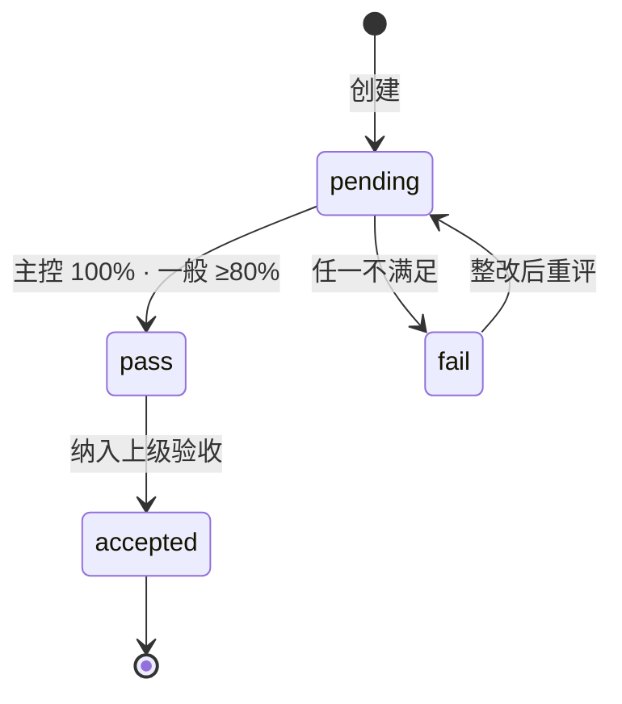

# 07-inspection_lot · WORKFLOW

---

## 1. 全景

## 2. 状态机

## 3. RACI

| 活动 | O | C | S |
|---|:-:|:-:|:-:|
| 划分检验批 | I | **R** | **A** |
| 主控 / 一般项目定义 | I | R | **A/R** |
| 自检 | I | **A/R** | C |
| 复核 | I | R | **A/R** |
| 不合格整改 | I | **A/R** | R |

## 4. 关键规则(GB 50300-2013)

- 主控不合格 · 整批 fail(无豁免)
- 一般项目合格率 ≥ 80% (专业规范更严从严)
- 有允许偏差 · 合格点率 ≥ 80%
- 返修后 · 再次 INSERT 一条新批 · 旧批保留 · 不原地覆盖(可回溯)

## 5. 聚合触发

| 源 | 目标 |
|---|---|
| inspection_lot.verdict = pass | sub_item rollup |
| sub_item 全 pass | sub_part rollup |
| sub_part 全 pass | unit_project rollup(08-acceptance) |

---

version: 0.1.0 · 2026-04-23
