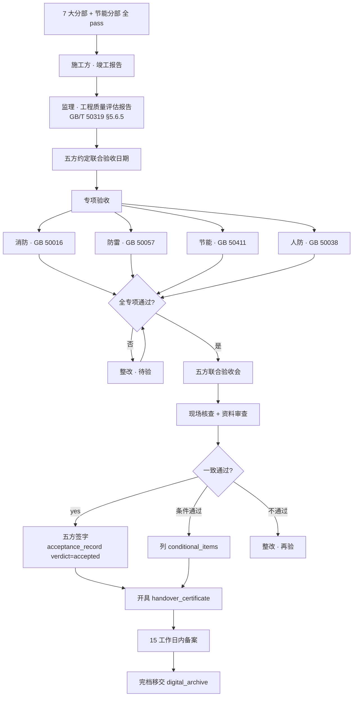
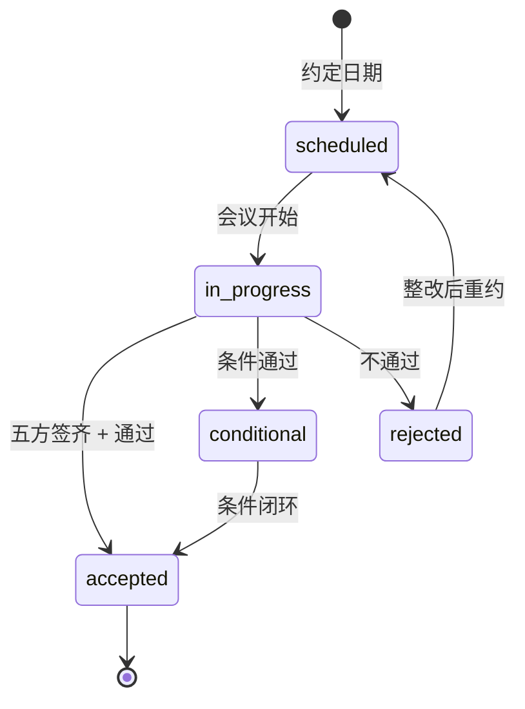
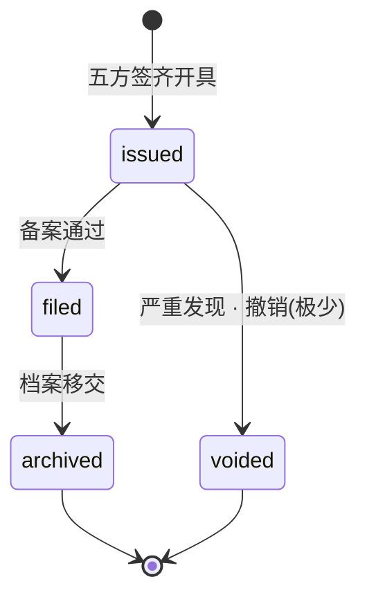
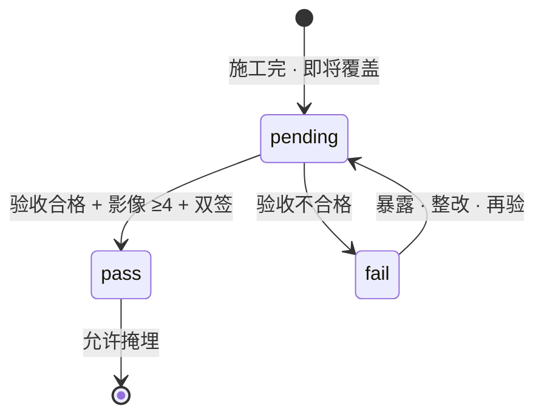

# 08-acceptance · WORKFLOW

---

## 1. 全景(竣工阶段)

## 2. 状态机

### acceptance_record

### handover_certificate

## 3. 隐蔽工程状态机

## 4. RACI · 五方联合验收

| 活动 | O | C | S | D | G |
|---|:-:|:-:|:-:|:-:|:-:|
| 竣工报告 | I | **A/R** | C | C | I |
| 质量评估报告 | I | I | **A/R** | I | I |
| 消防 / 节能 专项 | **A** | R | R | R | I |
| 五方约定 | **A/R** | R | R | R | R |
| 现场核查 | R | R | **R** | R | R |
| 验收决议 | **A/R** | R | R | R | R |
| 竣工证书开具 | **A/R** | R | R | R | I |
| 15 日备案 | **A/R** | C | C | I | I |
| 档案移交 | **A** | R | R | R | R |

## 5. 15 工作日备案(建质 171 号)

- 自 final_acceptance_date 起 · 15 工作日内(不含节假日)
- 逾期 · 建设单位被处罚(3 ~ 30 万)
- ArchIToken 在 filing_deadline 前 3 天推送警报

## 6. 触发

| 事件 | → |
|---|---|
| 所有 sub_part verdict=pass | unit_project rollup → 可进入竣工流程 |
| acceptance_record verdict=accepted (level=unit_project) | 生成 handover_certificate |
| handover_certificate filed | 触发 digital_archive 归档流程 |
| handover_certificate filed | 启动 digital_twin 的运维数据流 |

---

version: 0.1.0 · 2026-04-23
