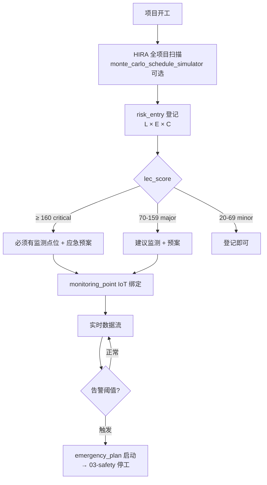

# SUBDOMAIN · 09-risk_analysis · 风险分析

> 系统性风险管理 · 登记册 + LEC + 监测点位 + 应急预案 · 区别于 03-safety 的"作业级"。

---

## 1. 定位

03-safety 管"已识别具体危大的法定流程"。
09 管"整个项目的系统性风险识别 / 定量 / 追踪"。
两者互补 · 03 偏操作 · 09 偏决策。

## 2. 核心实体

| 实体 | 表 |
|---|---|
| `risk_entry` | `csr.risk_entries` · 风险登记(LEC 三因子) |
| `risk_monitoring_point` | `csr.risk_monitoring_points` · 监测点位(对接 IoT) |
| `emergency_plan` | `csr.emergency_plans` · 应急预案 |

## 3. 主要标准

- **ISO 31000:2018** Risk management
- **GB/T 33859-2017** 风险管理 组织管理风险评估指南
- **GB/T 27921-2023** 风险评估技术(等同 IEC 31010)
- **GB/T 23694-2013** 风险管理术语
- **PMBOK Guide 7th** §11 风险管理

## 4. 业务场景

> 5/15 · 锦屏雨季临近 · 山区气象预警 · 系统自动识别 "山洪 / 落石 / 雷击" 3 类新风险。
> LEC 评分 · 2 条 high · 1 条 medium · 自动生成应急预案 + 监测点位。
> 6/11 暴雨预警 · 监测点触发告警 · 停工 1.5 日 · 后来成工期顺延的法律依据(见 01-progress)。

详见 [`examples/jinping_rainy_season_risk.md`](./examples/jinping_rainy_season_risk.md)

## 5. 关键流程

## 6. API

| Method | Path | 说明 |
|---|---|---|
| POST | `/v1/csr/risk-analysis/entries` | 登记风险 |
| POST | `/v1/csr/risk-analysis/monte-carlo` | 进度蒙特卡洛模拟(子域特定) |
| POST | `/v1/csr/risk-analysis/monitoring-points` | 监测点位 |
| POST | `/v1/csr/risk-analysis/emergency-plans` | 应急预案 |
| POST | `/v1/csr/risk-analysis/trigger-emergency/{plan_id}` | 启动预案 |

## 7. 前端组件

- `<RiskRegister />` · 风险登记册(表格 + 筛选)
- `<RiskHeatmap />` · L×C 热力图(10×5 网格)
- `<MonteCarloDashboard />` · 进度模拟 P10/P50/P90 曲线
- `<EmergencyPlanRunbook />` · 预案执行手册

## 8. Prompts

- `prompts/planner.md`
- `prompts/generator.md`
- `prompts/evaluator.md`
- `prompts/monte_carlo_schedule_simulator.md` · **核心** · 进度蒙特卡洛

## 9. 不变量

- I-1 · `lec_score ≥ 160` · 必须有关联的 monitoring_point(trigger 校验)
- I-2 · `lec_score ≥ 160` · 必须有对应的 emergency_plan
- I-3 · emergency_plan 每 6 个月必演练一次 · 无演练 flag
- I-4 · monitoring_point.threshold_json · 必须具体数值(不能写"危险")

## 10. SLA

| 操作 | planner | generator | evaluator |
|---|---|---|---|
| 蒙特卡洛 | 60s | 240s | 60s |
| 风险登记 | 30s | 60s | 30s |
| 预案生成 | 60s | 180s | 60s |

## 11. 状态

Stage 4 · 3 表 · 4 prompts · 锦屏雨季场景。

---

version: 0.1.0 · 2026-04-23
