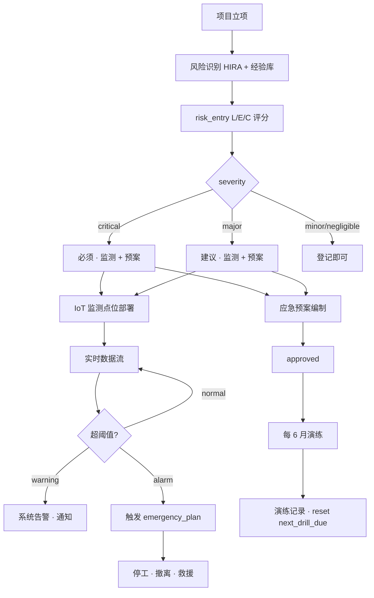
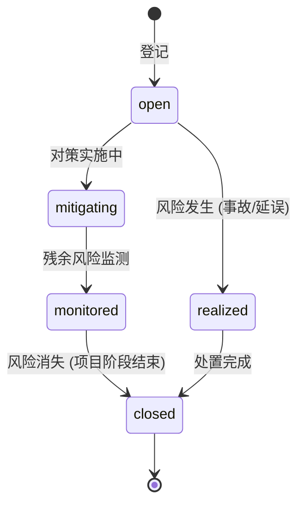
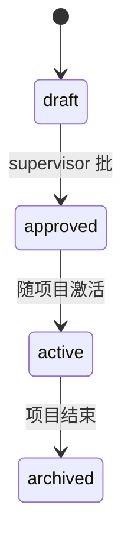

# 09-risk_analysis · WORKFLOW

---

## 1. 全景

## 2. 状态机

### risk_entry

### emergency_plan

## 3. RACI

| 活动 | O | C | S | SO |
|---|:-:|:-:|:-:|:-:|
| 风险识别 | I | R | **A/R** | R |
| LEC 评分 | I | R | **A/R** | R |
| 监测点位部署 | C (费用) | **A/R** | R | R |
| 预案编制 | I | R | **A/R** | R |
| 预案审批 | **A** | C | R | R |
| 定期演练 | I | **A/R** | R (观察) | R |
| 触发处置 | C | **A/R** | R | **R** |

## 4. 触发链

| 事件 | → |
|---|---|
| `risk_entry.severity=critical` 且监测点位为空 | CHECK 拒绝 |
| monitoring_point 超 alarm 阈 | emergency_plan 自动触发 → 03-safety work_permits 暂停 |
| emergency_plan 触发 | 01-progress activity.paused + supervisor 通知 |
| next_drill_due 到期 7 日内 | notifications + supervision_logs 提醒 |
| `realized_at` 填 | 01-progress 工期影响评估 + 12-change_order 潜在变更 |

---

version: 0.1.0 · 2026-04-23
