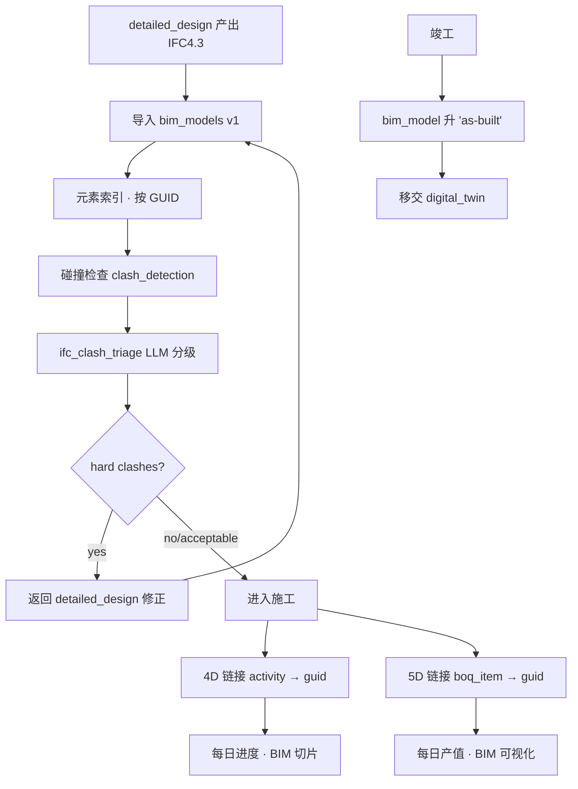

# SUBDOMAIN · 10-bim_integration · BIM 集成

> 施工阶段的 BIM 应用 · IFC 接入 · 4D (进度) · 5D (造价) · CDE 协同。

---

## 1. 定位

本子域是其它 11 子域的"空间基础":
- 01-progress 的 4D 工序锚定
- 02-quality / 03-safety / 07/08 的构件级事件定位
- 09-risk_analysis 的风险 3D 热图
- 与 detailed_design(BIM 主模型)保持镜像同步

## 2. 核心实体

| 实体 | 表 |
|---|---|
| `bim_model` | `csr.bim_models` · 模型版本 |
| `clash_report` | `csr.clash_reports` · 碰撞报告 |
| `bim_to_wbs_link` | `csr.bim_to_wbs_links` · 4D 链接 |
| `bim_to_boq_link` | `csr.bim_to_boq_links` · 5D 链接 |

## 3. 主要标准

- **ISO 19650-1:2018 / -2 / -3 / -5** BIM 信息管理全套
- **GB/T 51301-2018** 建筑信息模型设计交付标准
- **GB/T 51269-2017** BIM 分类与编码
- **GB/T 51447-2021** 建筑信息模型存储标准
- **AIA LOD Specification 2020** LOD 100-500
- **IFC 4.3** buildingSMART 最新主要版本

## 4. 业务场景

> 5/5 · 施工方提交 Revit 导出的 IFC4.3 · 监理 LLM `ifc_clash_triage` 1 分钟识别 38 硬碰撞 + 212 软碰撞。
> 按 severity 分级 · 12 条 must_fix(blocking) · 其它建议观察。
> 5/7 · 设计修正 + 再次碰撞 · 仅剩 3 软碰撞 · 通过进入施工阶段。

详见 [`examples/jinping_ifc_clash.md`](./examples/jinping_ifc_clash.md)

## 5. 关键流程

## 6. API

| Method | Path | 说明 |
|---|---|---|
| POST | `/v1/csr/bim/models` | 上传 BIM 模型(IFC) |
| POST | `/v1/csr/bim/clash-triage` | 碰撞分级(子域特定) |
| POST | `/v1/csr/bim/clash-reports` | 碰撞报告录入 |
| POST | `/v1/csr/bim/wbs-links` | 4D 链接批量 |
| POST | `/v1/csr/bim/boq-links` | 5D 链接批量 |
| GET | `/v1/csr/bim/element/{guid}` | 元素详情(含所有挂载) |

## 7. 前端组件

- `<BIMViewer />` · 核心 · Three.js r184 + IfcJS
- `<ClashReportViewer />` · 碰撞列表 + 3D 高亮
- `<FourDTimeline />` · 时间轴 + BIM 构件淡入淡出
- `<FiveDCostHeatmap />` · 按日期切片的 BOQ 完成度热图

## 8. Prompts

- `prompts/planner.md`
- `prompts/generator.md` · 碰撞叙述 / LOD 评估
- `prompts/evaluator.md`
- `prompts/ifc_clash_triage.md` · **核心** · IFC 碰撞分级

## 9. 不变量

- I-1 · `bim_model.ifc_uri` · 必须对象存储路径 + SHA-256
- I-2 · 同项目同时间 · 最多 1 个 bim_model.status='active'
- I-3 · `clash_report.hard_clash = TRUE` 未修正 · 不允许关联的 activities 进 active 施工
- I-4 · `bim_to_wbs_link.activity_id` + `bim_element_guid` 唯一(不重复)
- I-5 · IFC GUID 正则 `^[0-9A-Za-z_$]{22}$` 严格校验

## 10. SLA

| 操作 | planner | generator | evaluator |
|---|---|---|---|
| 碰撞分级 | 60s | 180s | 60s |
| 模型元数据解析 | 30s | 90s | 30s |
| 4D/5D 链接生成 | 30s | 60s | 30s |

## 11. 状态

Stage 4 · 4 表 · 4 prompts · 锦屏 IFC 碰撞场景。

---

version: 0.1.0 · 2026-04-23
