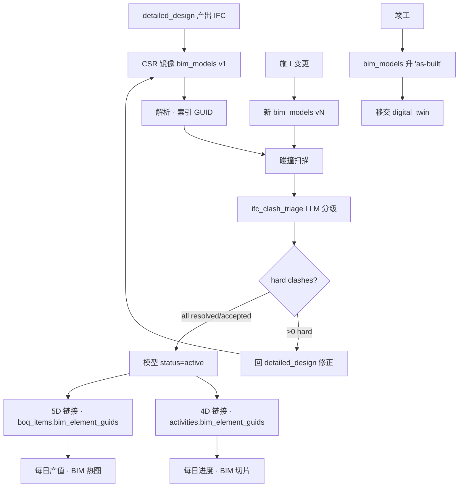
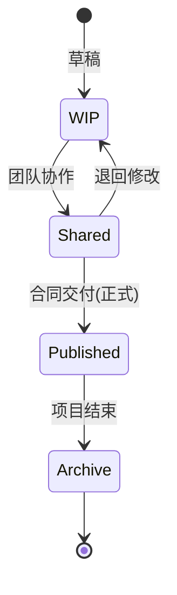
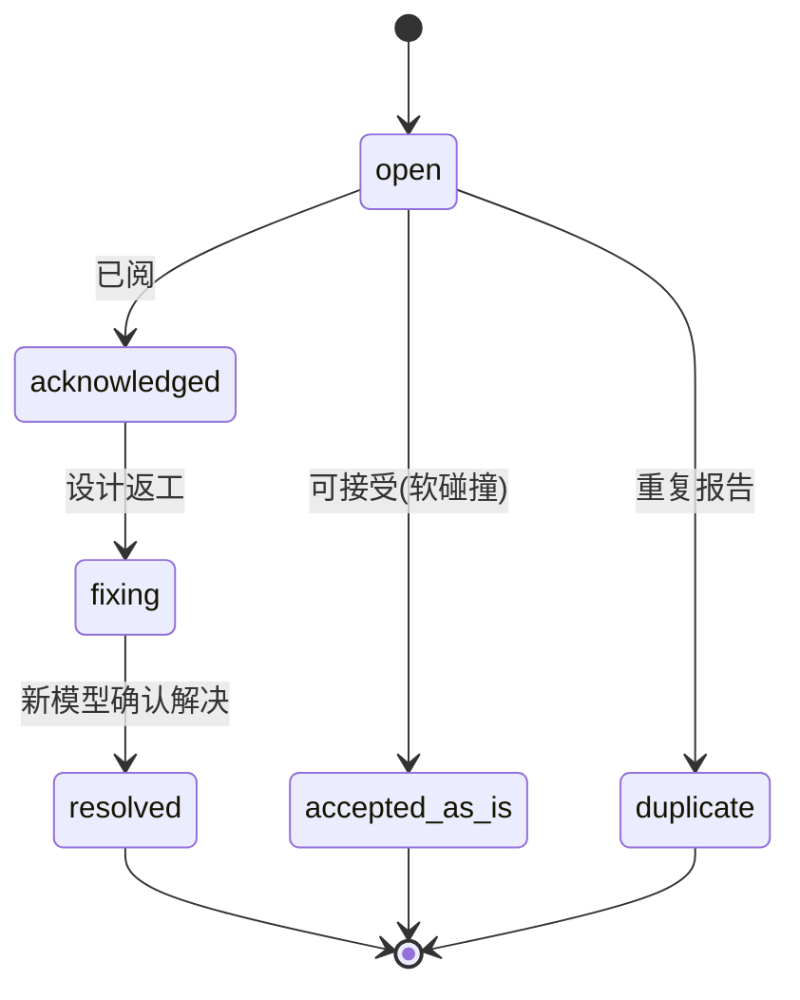

# 10-bim_integration · WORKFLOW

---

## 1. 全景

## 2. CDE 状态(ISO 19650)

## 3. clash_report 状态机

## 4. RACI

| 活动 | O | C | S | D |
|---|:-:|:-:|:-:|:-:|
| BIM 模型产出 | I | R | C | **A/R** |
| 碰撞扫描 | I | R | **A/R** | C |
| 分级 (triage) | I | I | **A/R** | C |
| 修正 (hard clashes) | I | R | R | **A/R** |
| 4D/5D 链接维护 | I | R | **A/R** | I |
| CDE 状态流转 | C | R | **A/R** | R |

## 5. 触发

| 事件 | → |
|---|---|
| bim_model status=active | 替换前一个为 superseded |
| clash_report.clash_type=hard AND status=open · 关联 activity | 禁止该 activity 进施工 |
| 每次 bim_model 上传 | 自动跑碰撞扫描 · 产出 clash_reports |

---

version: 0.1.0 · 2026-04-23
