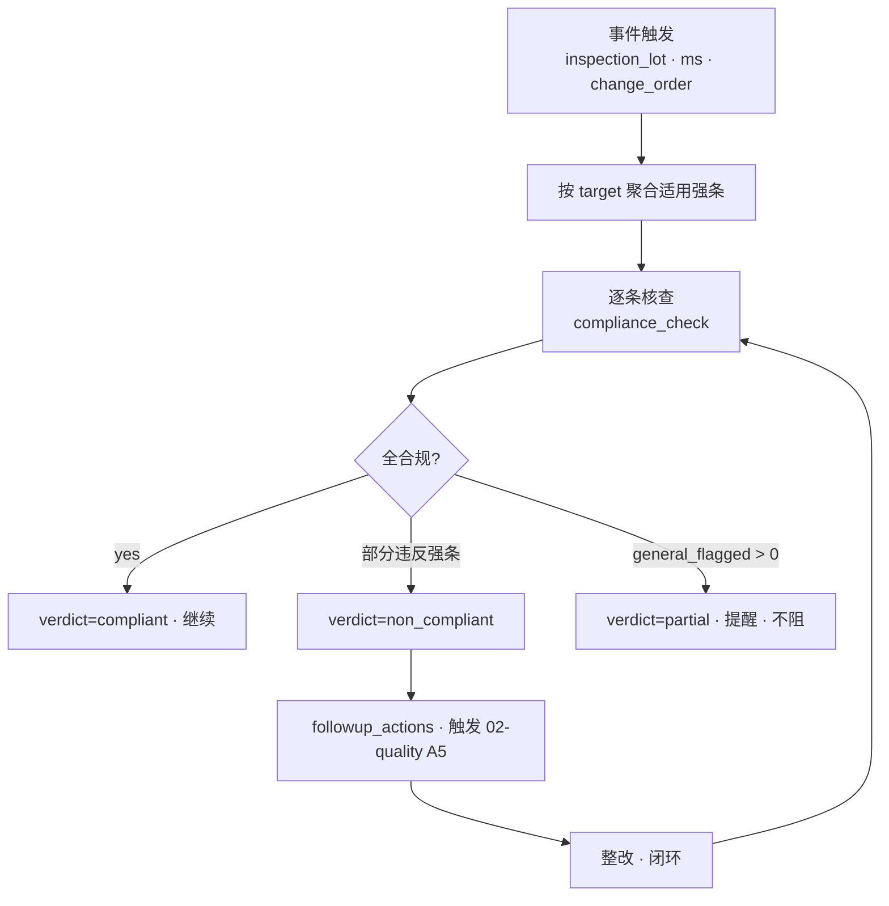
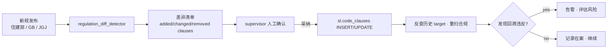
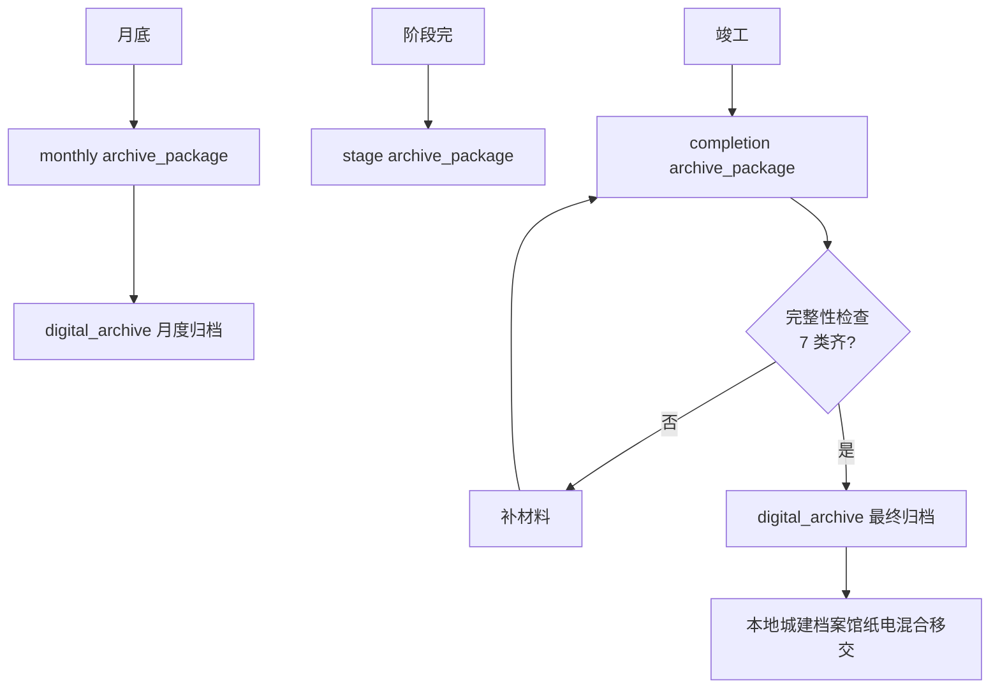

# 11-compliance · WORKFLOW

---

## 1. 合规扫描流程



## 2. 法规变更流程



## 3. 报建审批

```mermaid
flowchart LR
    A[开工前] --> B[construction_permit · 住建局]
    B --> C[quality_registration · 质监]
    B --> D[safety_filing · 安监]
    C & D --> E[开工]

    E --> F[施工过程]
    F --> G[fire_design_review · 消防设计审查]
    G --> H[fire_acceptance · 消防验收(竣工前)]
    F --> I[lightning_protection · 防雷验收]
    F --> J[civil_defense · 人防验收(如有)]
    F --> K[environmental · 环保验收]
    F --> L[energy · 节能验收]

    H & I & J & K & L --> M[竣工验收 · 08-acceptance]
```

## 4. 归档流程



## 5. RACI

| 活动 | O | C | S |
|---|:-:|:-:|:-:|
| 合规扫描 | I | I | **A/R** |
| 整改触发 | I | R | **A/R** |
| 法规采纳 | I | I | **A/R** |
| 报建准备 | **A/R** | R | C |
| 专项验收 | **A** | R | R |
| 归档包组装 | I | R | **A/R** |

## 6. 触发

| 事件 | → |
|---|---|
| inspection_lot verdict=pass | 本子域 auto compliance_check |
| method_statement approved | 同 |
| engineering_change approved | 同 |
| compliance_check verdict=non_compliant | 02-quality defect INSERT |
| 专项未通过 | 08-acceptance 阻 handover_certificate |
| 归档包 status=archived | digital_archive 接收 |

---

version: 0.1.0 · 2026-04-23
