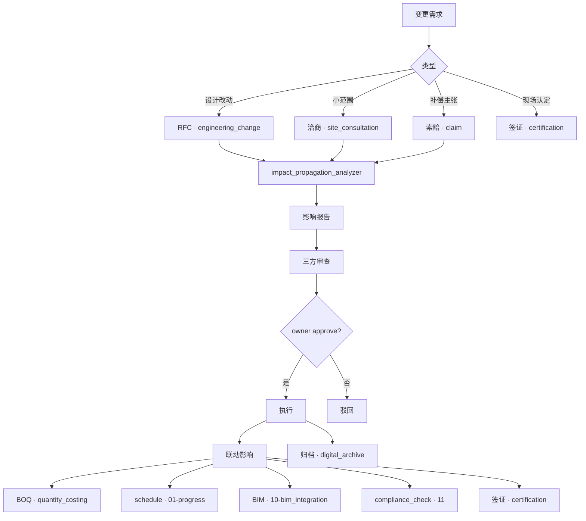
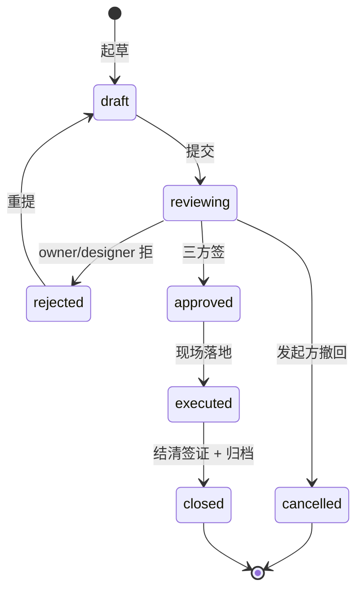
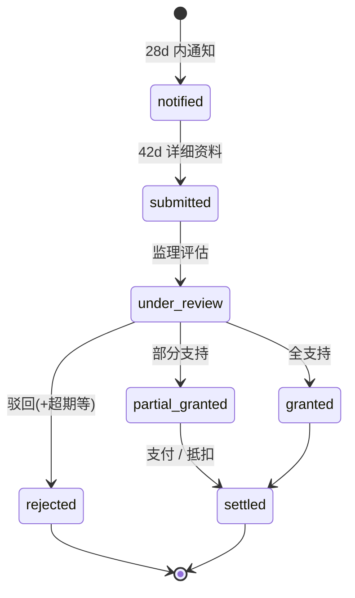

# 12-change_order · WORKFLOW

---

## 1. 全景

## 2. engineering_change 状态机

## 3. claim 状态机

## 4. RACI

| 活动 | O | C | S | D |
|---|:-:|:-:|:-:|:-:|
| RFC 发起 | R | R | R | R |
| RFC 审查 | I | C | **A/R** | R |
| 设计确认 | I | I | R | **A/R** |
| RFC 批准 | **A/R** | R | R | R |
| 洽商 agreed | **A/R** (> 1 万) | R | R | C |
| 索赔提交 | C | **A/R** | R | I |
| 索赔裁定 | **A/R** | R | **A/R** (建议) | I |
| 签证开具 | R | R | **A/R** | I |

## 5. 合同期限关键点

| 行为 | 期限 | 标号 |
|---|---|---|
| 索赔通知 | 28 天(自事件) | FIDIC §20 |
| 索赔详细资料 | 42 天 | FIDIC §20 |
| 业主回复 | 28 天 | FIDIC §20 |
| 设计变更答复 | 14 天 | GF-2017-0201 专用条款(通常) |

## 6. 跨子域触发

| 事件 | → |
|---|---|
| engineering_change.status = approved | 同步 quantity_costing(BOQ) + 01-progress(schedule) + 10-bim_integration(新 v) |
| claim.claim_type = time_extension + granted | 01-progress 合同竣工日更新 |
| certification.status = signed + amount > 0 | quantity_costing 新增清单条目 |
| 任何变更 | 11-compliance 自动跑一次强条扫描 |

---

version: 0.1.0 · 2026-04-23
