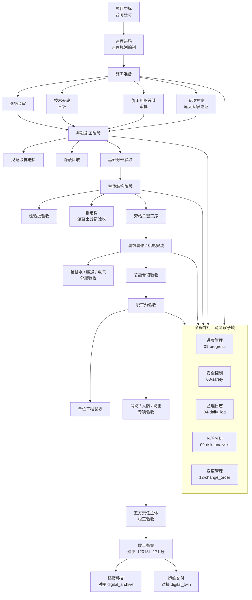

# construction_management · WORKFLOW

施工管理模块的全生命周期流程图 + 五方责任主体 RACI 矩阵。
基础 · GB/T 50319-2013 《建设工程监理规范》 · 建质〔2013〕171 号 竣工验收备案办法。

---

## 1. 五方责任主体 (五方 RACI 的"五方")

五方责任主体法定来源: 国务院令第 279 号《建设工程质量管理条例》第 26 条。

| 简称 | 全称 | 英文 | 角色 |
|---|---|---|---|
| **O** · Owner | 建设单位 (甲方) | Owner / Client | 出资方 · 最终验收人 · 承担项目法人责任 |
| **C** · Contractor | 施工单位 (总包) | Contractor | 施工实施方 · 对施工质量 / 安全直接负责 |
| **S** · Supervisor | 监理单位 | Supervisor | 受建设单位委托 · 对施工过程独立监督 |
| **D** · Designer | 勘察设计单位 | Designer | 出具勘察报告 / 设计图 · 解释设计意图 · 参与重要验收 |
| **G** · Geological | 勘察单位 (常与设计合并) | Geotechnical | 提供岩土工程勘察 · 参与基础分部验收 |

ArchIToken 的 LLM Agent (ArchIToken Agent) 作为"第六方"工具 · 不承担法律责任 · 但产出需经 S / C 签章确认。

---

## 2. 全生命周期 mermaid



---

## 3. 监理工作程序 (4 阶段 · 照 GB/T 50319-2013)

```mermaid
sequenceDiagram
    actor O as 建设单位<br/>Owner
    actor S as 监理单位<br/>Supervisor
    actor C as 施工单位<br/>Contractor
    actor D as 设计单位<br/>Designer

    rect rgb(240,248,255)
    Note over O,D: 阶段 1 · 施工准备
    O->>S: 委托监理合同
    S->>S: 编制监理规划 / 监理实施细则
    C->>S: 报审施工组织设计
    S->>O: 《监理规划》审批单
    D->>O,S,C: 图纸会审 (三方签认)
    end

    rect rgb(240,255,240)
    Note over O,D: 阶段 2 · 施工过程 (循环)
    C->>S: 报验 (工程量 · 隐蔽 · 检验批)
    S->>S: 平行检验 / 旁站 / 巡视
    S->>C: A5 整改通知单 (不合格)
    C->>S: 整改回复 + 复查请求
    S-->>S: 监理日记 (每日) · 监理月报 (每月)
    S->>O: 监理月报 + 整改闭环
    end

    rect rgb(255,250,240)
    Note over O,D: 阶段 3 · 竣工验收
    C->>S: 竣工报告
    S->>S: 预验收
    S->>O: 工程质量评估报告
    O->>O: 组织 OSDC + G 五方联合验收
    O->>O: 《竣工验收证明书》签发
    end

    rect rgb(255,240,245)
    Note over O,D: 阶段 4 · 竣工备案 (建质 171)
    O->>O: 竣工验收备案 (15 工作日内)
    O-->>S,C: 档案移交清单
    end
```

---

## 4. 五方 RACI 矩阵

R · Responsible (执行) · A · Accountable (最终负责) · C · Consulted (被咨询) · I · Informed (被告知)
多个 R 可同时 · 但 A 每任务唯一。

| 活动 | O | C | S | D | G |
|---|:-:|:-:|:-:|:-:|:-:|
| 监理规划编制 | I | I | **A/R** | I | I |
| 施工组织设计审批 | I | **R** | **A** | C | I |
| 图纸会审 | I | R | R | **A/R** | R |
| 技术交底 (三级) | I | **A/R** | R (见证) | C | I |
| 危大专项方案专家论证 | I | **R** | **A** | C | C |
| 施工放线与控制点移交 | A | R | R | C | **R** |
| 地基验槽 | A | R | **A/R** | **R** | **R** |
| 基础分部验收 | A | R | **A/R** | R | R |
| 见证取样送检 | I | R | **A/R** | I | I |
| 混凝土浇筑旁站 | I | R | **A/R** | I | I |
| 隐蔽工程验收 | I | R | **A/R** | I | I |
| 检验批验收 | I | **A/R** | R | I | I |
| 分项工程验收 | I | R | **A/R** | I | I |
| 分部工程验收 | A | R | **A/R** | R (勘察/设计分部) | R (勘察分部) |
| 实体检测见证 | I | R | **A/R** | I | I |
| A5 整改通知单 | I | R | **A/R** | I | I |
| 设计变更审批 | **A** | R | R | **R** | C |
| 工程洽商 | **A/R** | **R** | R | C | I |
| 索赔处理 | **A** | **R** | R (裁定建议) | C | I |
| 签证审批 | **A** | R | **A/R** | I | I |
| 进度计划审批 | I | **R** | **A** | I | I |
| 月度进度款计量 | **A** | R | **A/R** | I | I |
| 安全文明施工检查 | I | **A/R** | **R** | I | I |
| 危险源识别 (风险登记) | I | **A/R** | R | I | I |
| 事故 / 未遂上报 | I | **A/R** | R (见证+报告) | I | I |
| 监理月报 | I | I | **A/R** | I | I |
| 监理日志 | I | I | **A/R** | I | I |
| 竣工预验收 | I | R | **A/R** | R | R |
| 节能专项验收 | A | R | **A/R** | R | I |
| 消防 / 人防 / 防雷 专项 | **A** | R | R | R | I |
| 单位工程竣工验收 | **A/R** | R | R | R | R |
| 五方联合竣工验收 | **A/R** | **R** | **R** | **R** | **R** |
| 竣工备案 (建质 171) | **A/R** | I | I | I | I |
| 档案移交 | **A** | R | R | R | R |

---

## 5. SLA 触发表 (LangGraph 节点级)

| 模块节点 | Planner | Generator | Evaluator | 备注 |
|---|:-:|:-:|:-:|---|
| 通用默认 | 60s | 180s | 60s | 宪法 §8 |
| 危大专家论证生成 | 60s | 240s | 120s | 文本长 · 延长 evaluator |
| 监理月报汇总 | 30s | 120s | 30s | 结构化强 · 快产 |
| 变更影响评估 | 60s | 300s | 120s | 跨造价 / 工期 · 要算 |

SLA 超时触发 `RollbackGuard` (宪法 §15) · 30s 内切备选模型。

---

## 6. 与其它 13 模块的接口

| 对端模块 | 方向 | 接口内容 |
|---|---|---|
| `planning_management` | ← 输入 | WBS · 进度基线 · 资源计划 · 风险清单 |
| `detailed_design` | ← 输入 | BIM (IFC4) · 施工图 · 结构计算 |
| `production_manufacturing` | ← 输入 | 加工 BOM · 构件到场清单 · 工厂质检单 |
| `material_logistics` | ← 输入 | 运输单 · 进场批次 · 堆料计划 |
| `standard_library` | ← 引用 | 族库 · 节点做法 · 强条库 |
| `quantity_costing` | ↔ 双向 | BOQ 引用 (5D) + 变更计价回传 |
| `digital_twin` | → 输出 | 竣工 IFC · 关键工序 IoT 位点 |
| `digital_archive` | → 输出 | 归档包 (合同 · 日志 · 验收 · 影像) |
| `finance_hr` | → 输出 | 班组工时 · 变更索赔 · 成本偏差 |
| `ai_center` | ← 配置 | Planner/Generator/Evaluator 路由 · RAG/MCP 工具 |
| `settings_center` | ← 配置 | RBAC (五方 + 班组) · SLA 预算 · 模型路由 |
| `marketing_service` | -- 无 | |
| `concept_design` | -- 无 | |

---

## 7. 关键合规门槛 (CI 层可拦截)

- 任何 LLM 产出的 "验收合格" 结论 · 必须引用具体 GB 标号 + 条款
- 任何 "整改通知单" · 必须有关联 `inspection_lot` 或 `safety_hazard` 记录
- 任何 "隐蔽验收合格" · 必须伴随 ≥ 4 张 `photo_evidence` (GB 50300 §4.0.6 精神)
- 任何 "竣工验收合格" · 必须 4 个分部全部 `status = accepted`

---

version: 0.1.0 · 2026-04-23
