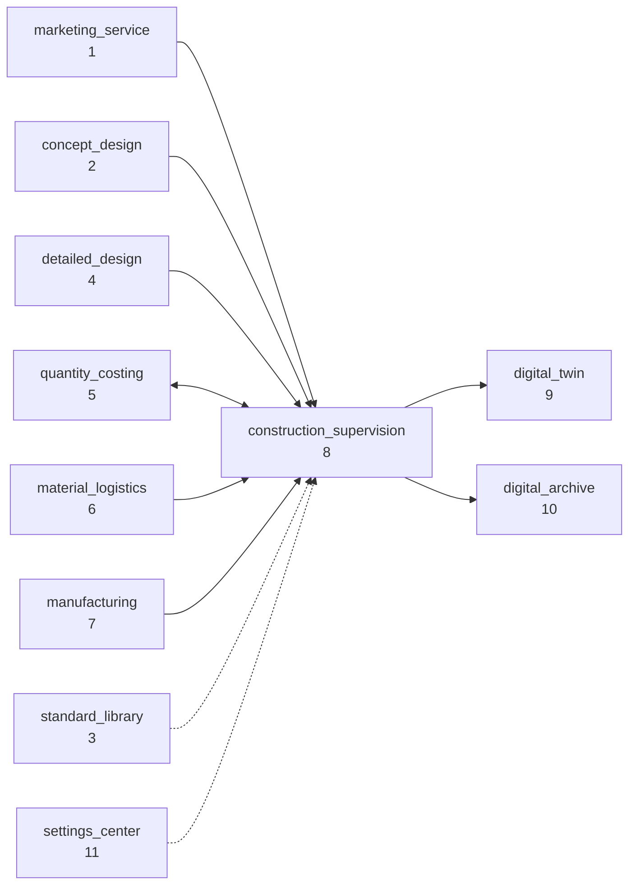

# construction_supervision · INTEGRATION

与其它 10 模块的集成契约 · 细化 MANIFEST.md 的 upstream/downstream。

---

## 1. 总览图



实线 · 数据流。虚线 · 引用(配置 / 标准)。双向 · 双向联动。

---

## 2. Upstream · 输入

### 2.1 marketing_service → CSR

**触发**: 合同签订 · `marketing_service.quotes_final.status = 'signed'`
**数据**: 项目基本信息 + 合同金额 + 客户

| 对接方式 | CSR 表 |
|---|---|
| `INSERT public.projects` · module_id 从 'marketing_service' → 'construction_supervision' | public.projects |
| INSERT csr.contracts(main_construction) | csr.contracts |
| INSERT csr.parties(owner)· 从 `marketing_service.contacts` 拷 | csr.parties |

**消息**: pgmq `marketing_service.contract_signed` → CSR listener。

---

### 2.2 concept_design → CSR

**触发**: 方案最终选定 · `concept_design.concepts.final=TRUE`
**数据**: 选定方案 + BIM 初版

| 对接方式 | CSR 表 |
|---|---|
| `csr.sub_parts` 按 concept 初始分部 | sub_parts |
| `csr.bim_models v0-concept` · origin='concept_design' | bim_models |

---

### 2.3 detailed_design → CSR (最大上游)

**触发**: 施工图 + BIM 定稿 · `detailed_design.bim_models.published_at` 填入
**数据**: BIM + 图纸 + 结构计算 + 碰撞初扫

| 对接方式 | CSR 表 |
|---|---|
| `csr.bim_models v1-active` · ifc_uri + sha256 镜像 | bim_models |
| `csr.drawings` · 施工图 PDF 镜像 | (未建 · Stage 5+) |
| `csr.sub_parts` 完整 8 分部树 · 基于结构方案 | sub_parts |

**消息**: pgmq `detailed_design.bim_published` + `.drawings_released`。

---

### 2.4 quantity_costing ↔ CSR (双向)

**上行**: BOQ 基线 → CSR 5D 链接
**下行**: CSR 变更 → BOQ 调整

| CSR 表 | 对端表 | 同步方向 |
|---|---|---|
| `csr.bim_to_boq_links` | `qc.boq_items` | CSR 引用 · 读 |
| `csr.engineering_changes.affected_boq_items` | `qc.boq_items` | CSR 写 · 触发 qc 新版 BOQ |
| `csr.certifications.amount_cny` | `qc.cost_adjustments` | CSR 写 · qc 读 |

**消息**:
- `quantity_costing.boq_baseline_set` → CSR 刷新 bim_to_boq_links
- `csr.engineering_changes.approved` → qc 生成 boq 新版

---

### 2.5 material_logistics → CSR

**触发**: 材料到场 · `material_logistics.shipments.arrived_at` 填
**数据**: 批次 + 数量 + 单据

| 对接方式 | CSR 表 |
|---|---|
| `csr.material_receipts` · 从 shipment 派生验收记录 | material_receipts |

---

### 2.6 manufacturing → CSR

**触发**: 工厂构件完工 · 准备进场
**数据**: 加工 BOM · 质检单 · WPS / PQR(钢结构)

| 对接方式 | CSR 表 |
|---|---|
| `csr.material_receipts(category=factory_component)` | material_receipts |
| `csr.test_witnessings` 对接工厂 UT 报告 | test_witnessings |

---

### 2.7 standard_library ← CSR (引用)

**读取**: CSR 所有 compliance_check / 合规判定 / 抽样规则 · 都来自 SL。

| CSR 表 | SL 表 |
|---|---|
| `csr.compliance_checks.clauses_checked` | `sl.code_clauses`(读) |
| `csr.inspection_lots.main_items` 的 standard + clause | `sl.code_clauses`(读) |

CSR 不写 · 只读。SL 的 pgvector 语义搜索对 CSR 开放。

---

### 2.8 settings_center ← CSR (配置)

**读取**: 全局配置 · RBAC / 模型路由 / SLA 预算 / 项目模板。

| 配置 key | 用途 |
|---|---|
| `settings_center.role_bindings` | CSR 行为鉴权 |
| `settings_center.model_routes` | 决定 CSR LangGraph 用哪个 LLM |
| `settings_center.sla_budgets` | CSR 每个 prompt 的 SLA |
| `settings_center.project_templates` | 按项目类型预设 sub_parts / risk / method_statement 骨架 |

---

## 3. Downstream · 输出

### 3.1 CSR → digital_twin

**触发**: `csr.handover_certificates.status = 'filed'`
**数据**: 竣工模型 + IoT 点位 + 验收资料

| 对接方式 | DT 表 |
|---|---|
| `bim_models(as-built)` · 模型 URI + SHA256 | `dt.twin_models` |
| `risk_monitoring_points.status='active'` 继续运行的点位 | `dt.iot_streams` |
| `unit_project.verdict='accepted'` 作为 DT 起点 | `dt.assets` |

**消息**: pgmq `csr.handover_filed` → DT 启动运维数据流。

---

### 3.2 CSR → digital_archive

**触发**: `csr.archive_packages.status='ready'`(月度 / 阶段 / 竣工 各自节律)
**数据**: 归档包(zip)+ 清单 + 关联业务单

| 对接方式 | DA 表 |
|---|---|
| `archive_packages.items_json` | `da.archive_items`(按 item 铺) |
| `archive_packages.package_uri` | `da.archive_packages` |

**消息**: pgmq `csr.archive_package_ready` → DA 接收 · 纳入保管周期 · 与地方城建档案馆对接。

---

## 4. 接口契约(pgmq 消息格式)

### 4.1 inbound(CSR 订阅)

```json
{
  "topic":"marketing_service.contract_signed",
  "version":"1",
  "tenant_id":"uuid",
  "project_id":"uuid",
  "payload":{
    "contract_amount_cny":680000,
    "owner_info":{...},
    "signed_at":"2026-04-20T10:00:00+08:00"
  },
  "correlation_id":"uuid"
}
```

### 4.2 outbound(CSR 发布)

```json
{
  "topic":"csr.handover_filed",
  "version":"1",
  "tenant_id":"uuid",
  "project_id":"uuid",
  "payload":{
    "handover_certificate_id":"uuid",
    "as_built_bim_uri":"s3://...",
    "as_built_bim_sha256":"...",
    "monitoring_points_to_operate":["<mp1>","<mp2>"]
  },
  "correlation_id":"uuid"
}
```

---

## 5. 跨模块事务边界

**CSR 不使用分布式事务(Saga only)**。原则:
- 每个 CSR 子域 commit · 后台 pgmq 异步通知下游
- 下游失败 · CSR 不回滚 · 但入 audit_log + 告警
- 双向(qc)· 按 correlation_id 配对消息 · 超 5 分钟未配对 · 人工介入

---

## 6. 权限对接(settings_center)

CSR 使用的角色:
- `csr.read` · 只读
- `csr.write.progress` · 进度子域写
- `csr.write.quality` · 质量子域写
- `csr.write.safety` · 安全子域写
- `csr.write.all` · 全部子域
- `csr.supervisor` · 监理专属(签 A5 · 签 B3)
- `csr.owner.approve` · 业主专属(批 RFC · 批 NCR 让步)

规则由 `settings_center.role_bindings` 管理 · OPA 策略实时评估。

---

## 7. 版本协商

模块接口遵循 SemVer:
- 本 CSR 模块版本:0.1.0
- 对接模块版本范围 · 记录于 `MANIFEST.md` 顶部
- 破坏性变更 · 需 major 升级 + 双向兼容期

---

## 8. 监控与 SLA

| 交互 | SLA |
|---|---|
| 合同签订 → CSR 建项目 | 5 秒 |
| BIM 发布 → CSR 镜像 | 30 秒 |
| BOQ 同步 | 1 分钟 |
| 归档包发布 → DA 接收 | 1 小时 |
| 竣工 → DT 切换 | 4 小时(含 IFC 属性回写) |

超 SLA 告警 → Langfuse trace + OPS oncall。

---

version: 0.1.0 · 2026-04-23
