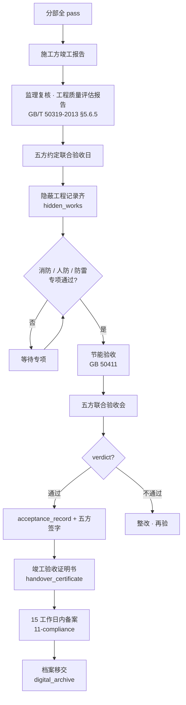

# SUBDOMAIN · 08-acceptance · 验收管理

> 从隐蔽工程到五方联合竣工验收 · 合并原 v2.0 的 acceptance 阶段。

---

## 1. 定位

法理基础:建质〔2013〕171 号 + 国务院令第 279 号 · 五方责任主体共同验收。
本子域管:
- 单位工程 `unit_project`
- 验收记录 `acceptance_record`(统一对 inspection_lot / sub_item / sub_part / unit_project 四级)
- 隐蔽工程记录 `hidden_work`
- 竣工 / 移交证书 `handover_certificate`

## 2. 核心实体

| 实体 | 表 |
|---|---|
| `unit_project` | `csr.unit_projects` · 单位工程 |
| `acceptance_record` | `csr.acceptance_records` · 验收记录 |
| `hidden_work` | `csr.hidden_works` · 隐蔽工程 |
| `handover_certificate` | `csr.handover_certificates` · 竣工 / 移交 |

## 3. 主要标准

- **GB 50300-2013** 根验收标准
- **建质〔2013〕171 号** 房屋建筑和市政基础设施工程竣工验收备案管理办法
- **国务院令第 279 号** 建设工程质量管理条例 §7 "五方责任主体"
- **GB/T 50319-2013** §5.6 工程质量评估报告
- **GB/T 50328-2019** 文件归档规范

## 4. 业务场景

> 6/12 · 锦屏项目 8 大分部全 pass · 进入竣工预验收。
> 监理出工程质量评估报告 · 6/13 组织五方联合验收 · 五方签字 · 6/14 备案。

详见 [`examples/jinping_completion_acceptance.md`](./examples/jinping_completion_acceptance.md)

## 5. 关键流程

## 6. API

| Method | Path | 说明 |
|---|---|---|
| POST | `/v1/csr/acceptance/unit-projects` | 创建单位工程 |
| POST | `/v1/csr/acceptance/records` | 验收记录 |
| POST | `/v1/csr/acceptance/hidden-works` | 隐蔽工程记录 |
| POST | `/v1/csr/acceptance/records/{id}/sign` | 某方签字 |
| POST | `/v1/csr/acceptance/handover-certificates` | 竣工证书 |
| POST | `/v1/csr/acceptance/five-parties-signoff-orchestrator` | LLM 协调(子域特定) |

## 7. 前端组件

- `<UnitProjectSummary />` · 单位工程全景
- `<HiddenWorkForm />` · 隐蔽记录 · 强制 ≥ 4 张影像
- `<AcceptanceRecordForm />` · 验收记录 · 引标号
- `<FivePartiesSignoffPanel />` · 五方签字面板(GB 50300 附录)

## 8. Prompts

- `prompts/planner.md`
- `prompts/generator.md` · 验收记录 / 隐蔽记录 / 质量评估报告草稿
- `prompts/evaluator.md`
- `prompts/five_parties_signoff_orchestrator.md` · **核心** · 五方签认协调

## 9. 不变量

- I-1 · `acceptance_record.verdict=accepted` · 必须有 `standards_cited[]` ≥ 1 条
- I-2 · 五方联合验收 · `signed_by_owner/contractor/supervisor/designer/geotechnical` 各至少 1 签字 id
- I-3 · `hidden_work.photo_evidence_ids` ≥ 4 张(GB 50300 精神 · 前中后多角度)
- I-4 · `handover_certificate` · 必须关联所有 8 大分部的 acceptance_record
- I-5 · 竣工验收通过后 15 工作日内 · 触发 11-compliance 的 `permit_approvals` 备案流程

## 10. SLA

| 操作 | planner | generator | evaluator |
|---|---|---|---|
| 质量评估报告 | 60s | 300s | 120s |
| 五方协调邀请 | 30s | 120s | 30s |
| 隐蔽验收记录 | 30s | 60s | 30s |

## 11. 状态

Stage 3 · 4 表 · 4 prompts · 锦屏竣工验收场景。

---

version: 0.1.0 · 2026-04-23
