# ArchIToken Panorama

**Status**: active architecture panorama
**Project**: ArchIToken
**Scope**: business modules, file system, lifecycle, AI chain, StorageRouter, digital twin, deployment and governance

---

## 1. Overall Architecture

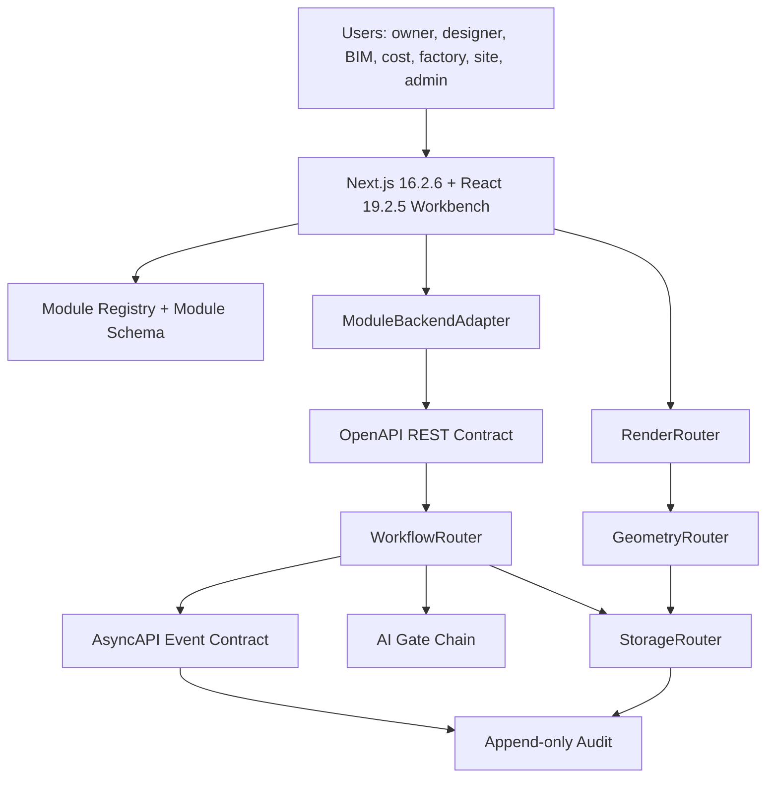

---

## 2. 11 Module Business Map

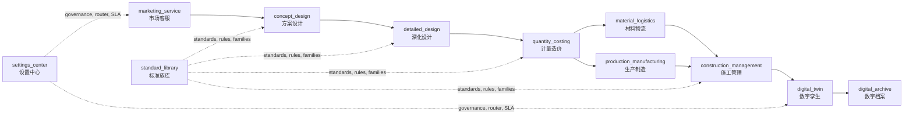

`production_manufacturing` is the active production module ID.

---

## 3. File System Map

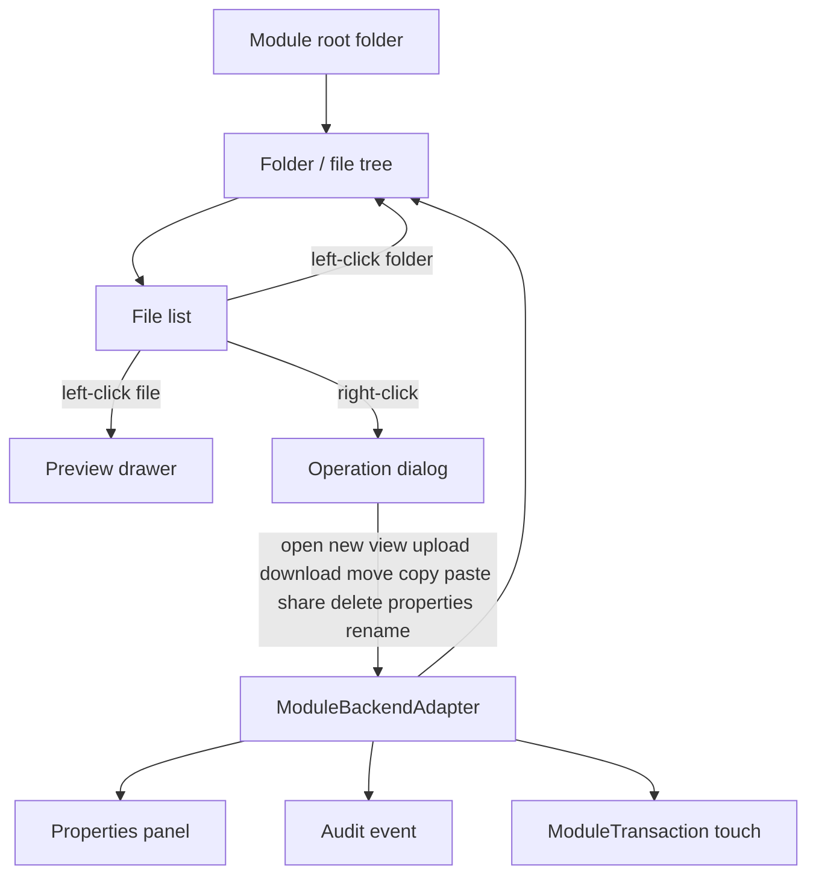

Right-click operations:

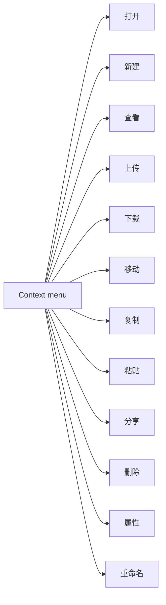

---

## 4. Lifecycle State Machine

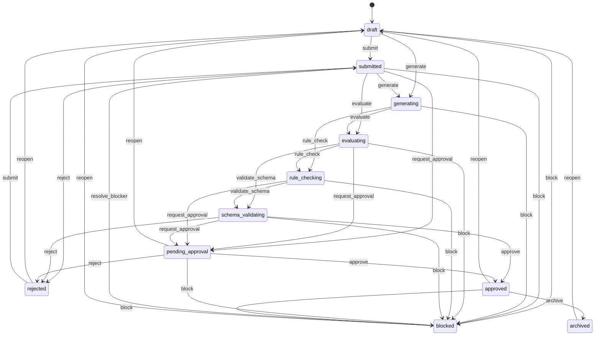

---

## 5. AI Engineering Chain

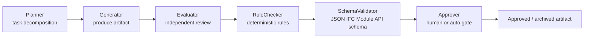

Generator must not evaluate itself.

---

## 6. StorageRouter Map

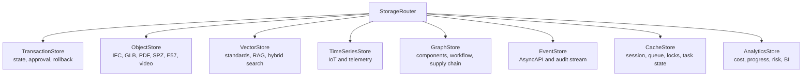

Database products are adapters under these capabilities.

---

## 7. Digital Twin Map

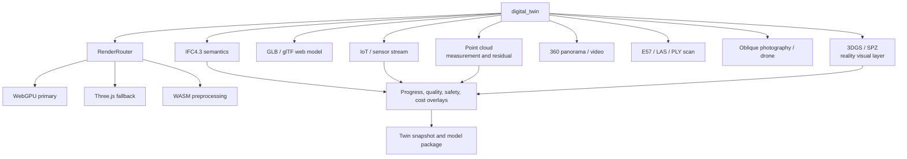

Point cloud is for measurement/control. 3DGS is an image-based reality layer.

---

## 8. Deployment Map

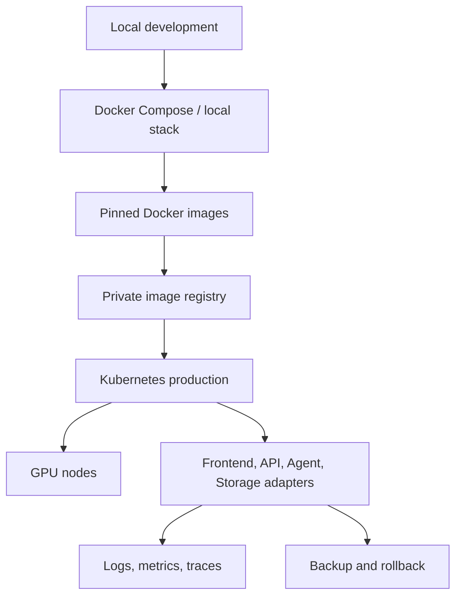

Kubernetes and Docker are baseline. Local private deployment is a product requirement.

---

## 9. CI And Governance Map

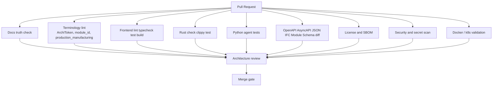

Strict CI is intentional. Do not remove gates to hide architectural drift.

---

## 10. Contract Summary

| Contract | Active Rule |
|---|---|
| Project name | `ArchIToken` active product, repository and compatibility name |
| Module identity | `module_id`, not `ModuleId` |
| Manufacturing | `production_manufacturing` active |
| Extensibility | Registry, not Enum |
| Data | StorageRouter capabilities |
| AI | Six-gate chain with independent evaluator |
| Rendering | WebGPU first, Three.js fallback |
| Deployment | k8s + Docker + local private |
| Docs | Repository docs are the only truth source |

---

## 11. Local File Runtime 图

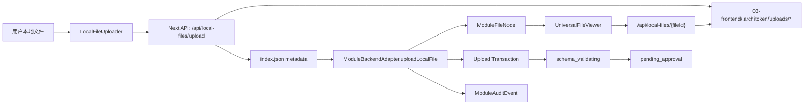

## 12. 统一主题 Shell 与数字孪生画布边界

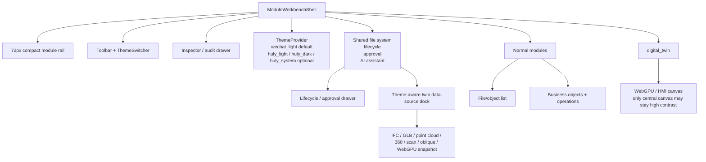
