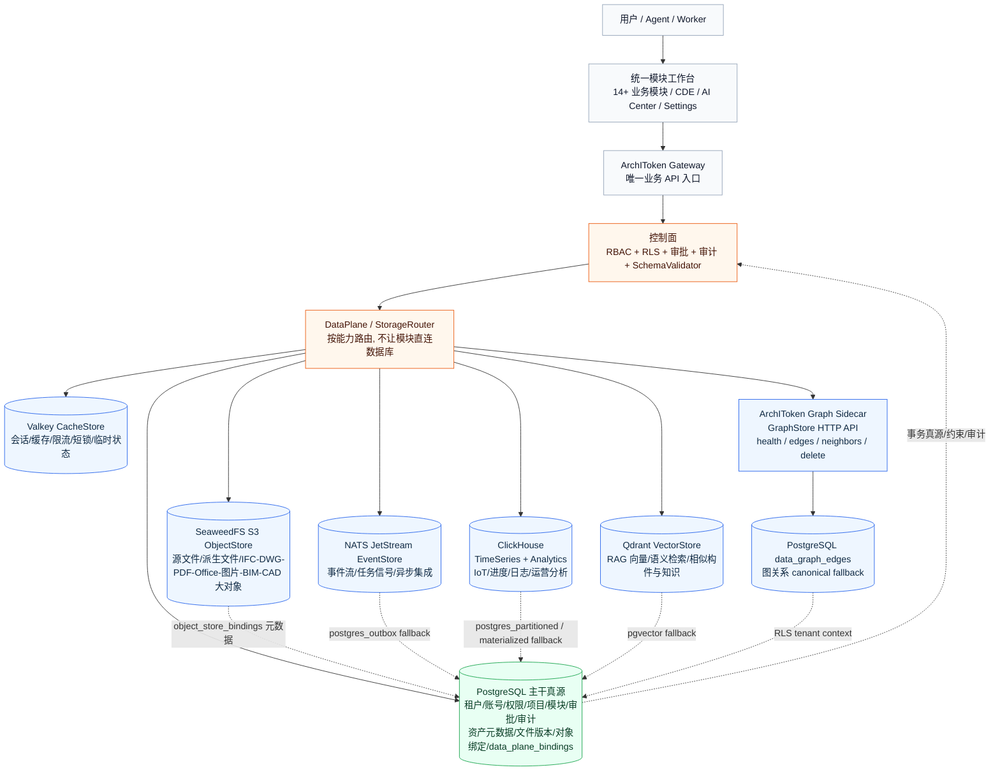

# ArchIToken Database Design In One Diagram

Snapshot: 2026-06-09.

One sentence summary:

ArchIToken 的数据库不是一个大库包打天下，而是 **PostgreSQL 做业务真源和审计约束，DataPlane 把文件、缓存、事件、向量、时序分析、图关系分别路由到真实专用存储；所有模块只能经过 Gateway/Router/审批审计链路访问，不允许前端或业务模块绕开直连。**
