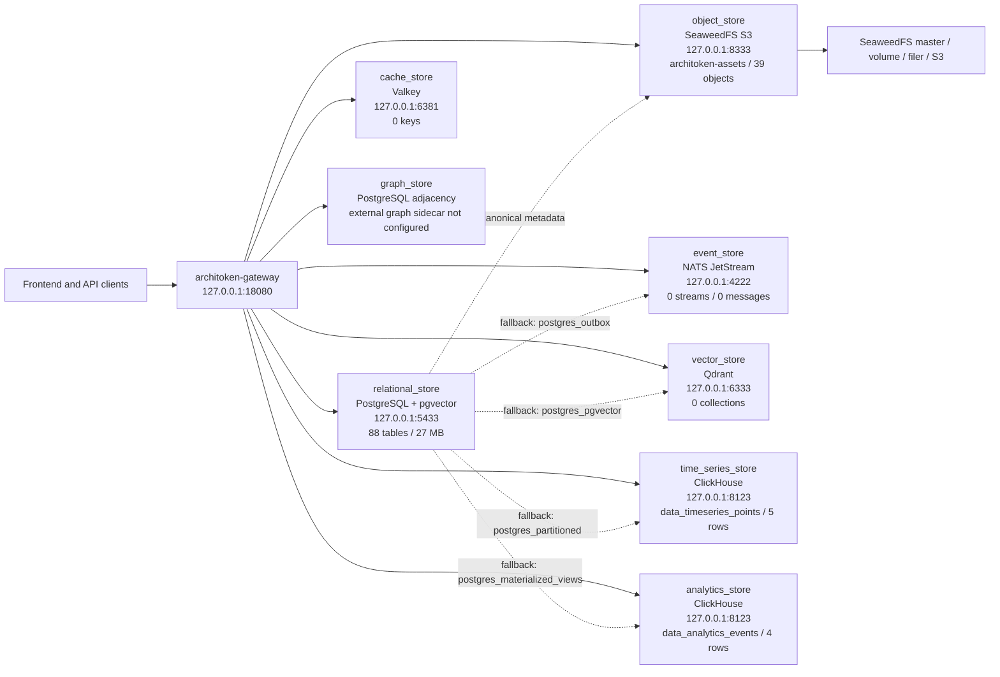
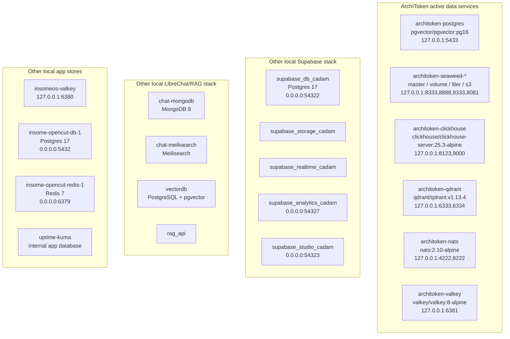

# ArchIToken Database Runtime Topology

Snapshot: 2026-06-03, local development runtime.

This document records the live database and storage shape observed from the
running ArchIToken gateway, data-plane binding API, local service ports and
Docker containers. It is a runtime snapshot, not a production certification.

## Current Verdict

ArchIToken is currently running with a real external data-service plane for the
main storage capabilities:

| Capability | Current provider | Runtime state | Notes |
|---|---|---|---|
| Relational store | PostgreSQL + pgvector | Live | Primary system of record. 88 public tables, about 27 MB. |
| Object store | SeaweedFS S3 | Live | Bucket `architoken-assets` has 39 objects. PostgreSQL stores bindings/metadata. |
| Cache store | Valkey | Live | Service healthy. Current keyspace is empty. Ephemeral only. |
| Event store | NATS JetStream | Live | JetStream enabled. Current streams/consumers/messages are 0. PostgreSQL outbox remains fallback. |
| Vector store | Qdrant | Live route configured | Provider is `qdrant`. Current collections are 0 because no persistent RAG corpus has been loaded and smoke collections are cleaned up. |
| Time-series store | ClickHouse | Live | Table `data_timeseries_points` has 5 rows. PostgreSQL partitioned table remains fallback. |
| Analytics store | ClickHouse | Live | Table `data_analytics_events` has 4 rows. PostgreSQL materialized-view path remains fallback. |
| Graph store | PostgreSQL adjacency | Not externalized | External graph sidecar is intentionally not configured. |

Gateway readiness reports:

| Field | Value |
|---|---|
| status | `ready` |
| runtime profile | `development` |
| persistence mode | `durable_postgres` |
| database configured | `true` |
| object store configured | `true` |
| queue configured | `true` |
| telemetry configured | `true` |

## ArchIToken Data Plane

## Runtime Binding Detail

| Capability | Provider | Fallback | Externalized | Runtime rule |
|---|---|---|---|---|
| `relational_store` | `postgres` | `memory` | Yes | Core business records stay in the primary relational store. |
| `object_store` | `seaweedfs_s3` | `memory` | Yes | Large source bytes and derived artifacts route through ObjectStore. |
| `cache_store` | `valkey` | `memory` | Yes | Ephemeral state routes through CacheStore. |
| `event_store` | `nats_jetstream` | `postgres_outbox` | Yes | Audit, workflow and integration events route through EventStore. |
| `vector_store` | `qdrant` | `postgres_pgvector` | Yes | RAG and semantic search route through VectorStore. |
| `time_series_store` | `clickhouse` | `postgres_partitioned` | Yes | IoT, telemetry and progress points route through TimeSeriesStore. |
| `analytics_store` | `clickhouse` | `postgres_materialized_views` | Yes | Operational aggregates and product analytics route through AnalyticsStore. |
| `graph_store` | `postgres_adjacency` | `postgres_adjacency` | No | Component, workflow and knowledge relations route through GraphStore. |

## PostgreSQL Shape

PostgreSQL is the trunk and canonical metadata database. The largest observed
tables by estimated row count are:

| Table | Estimated rows |
|---|---:|
| `iam_role_permissions` | 1377 |
| `audit_events` | 443 |
| `iam_roles` | 189 |
| `conversion_jobs` | 104 |
| `asset_versions` | 55 |
| `asset_files` | 46 |
| `assets` | 46 |
| `object_store_bindings` | 46 |
| `semantic_dictionary_rdf_terms` | 25 |
| `auth_sessions` | 22 |
| `modules` | 17 |
| `data_timeseries_points` | 10 |
| `data_event_outbox` | 10 |
| `data_graph_edges` | 10 |
| `data_analytics_events` | 10 |

Interpretation:

- PostgreSQL remains the source of truth for tenants, auth, IAM, modules, audit,
  jobs, assets, object bindings and graph adjacency.
- Several `data_*` tables remain in PostgreSQL as trunk/fallback tables even when
  the active runtime provider is ClickHouse, NATS or Qdrant.
- Object bytes are not stored in PostgreSQL; PostgreSQL stores object bindings
  and metadata while SeaweedFS S3 stores the bytes.

## Local Container Inventory

Only the `architoken-*` containers are currently evidenced as active providers
for the ArchIToken gateway data-plane routes. The Supabase, LibreChat/RAG,
OpenCut and uptime containers are running on the same machine, but they are not
shown by `/v1/data-plane/bindings` as ArchIToken gateway providers.

## What Is Real And What Is Still Pending

Real and actively wired:

- PostgreSQL trunk store.
- SeaweedFS S3 object store.
- ClickHouse for time-series and analytics API paths.
- Qdrant as the selected vector provider route.
- NATS JetStream as the selected event provider route.
- Valkey as the selected cache provider route.

Real service but currently empty:

- Qdrant has no collections yet.
- NATS JetStream has no streams, consumers or messages yet.
- Valkey has no keys yet.

Still not externalized:

- Graph store is intentionally still PostgreSQL adjacency because no reviewed
  graph sidecar is configured.

