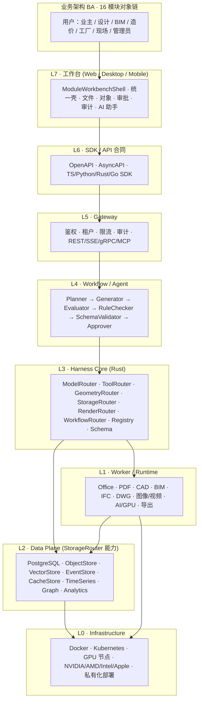
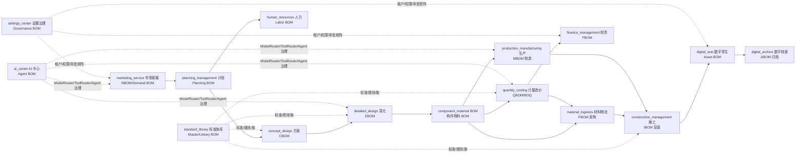
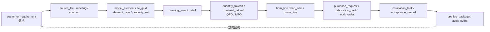
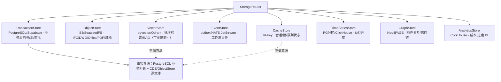
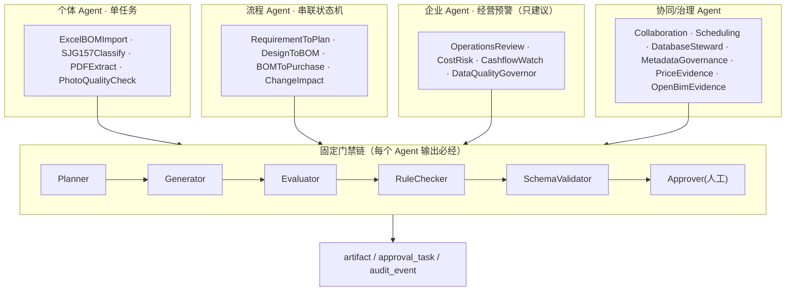
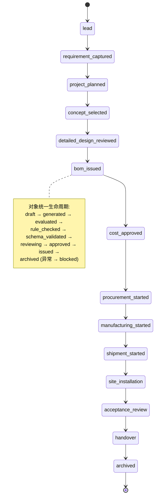
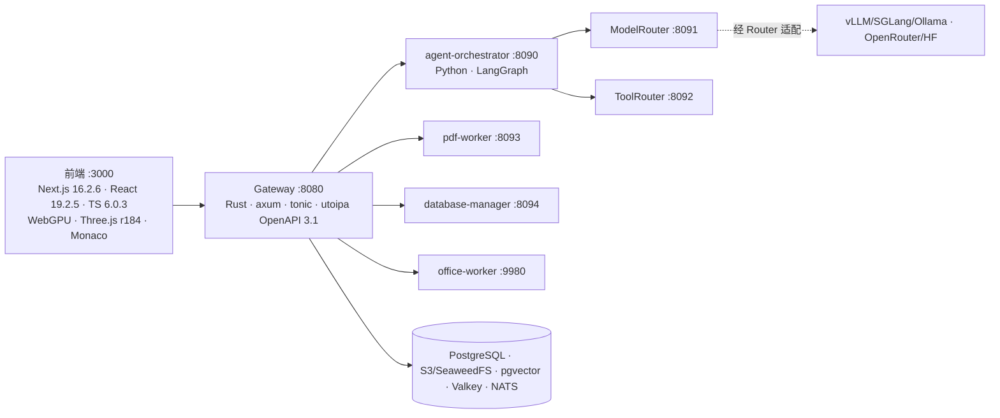
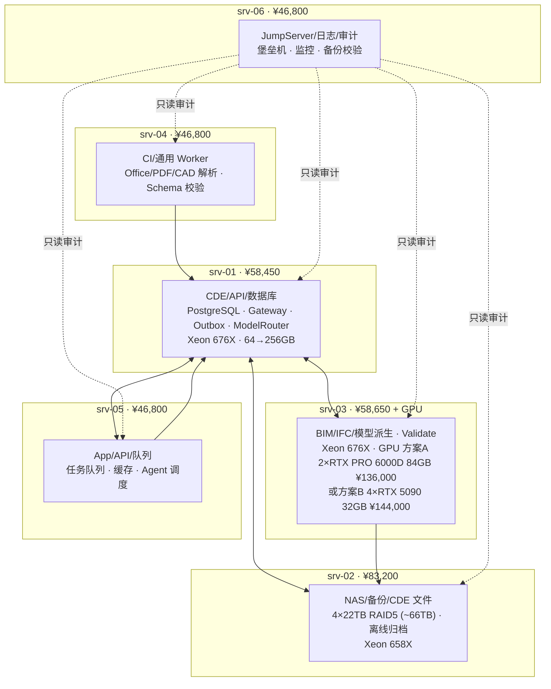

# ArchIToken 完整架构图 · 2026-06-10

> AEC AI-Native + Harness Engineering + OpenBIM CDE Workflow OS
> 真源：全产品应用/BOM/数据库/Agent/Workflow/技术架构主文档 + 2026-06-10 架构评审 Gate

---

## 1. 总体分层架构（L7 → L0 + 4A）

---

## 2. 16 模块业务对象链 + BOM 形态（端到端闭环）

> 下游只读上游 **issued** 版本；跨模块只按 `project_id / object_id / version_id` 引用，不复制第二真源。

---

## 3. AI 正向工程闭环（构件实例血缘链）

> 工程对象 = 类型 + 几何 + 属性集 + 关系 + 版本证据；AI 输出默认 `draft_assist` / `professional_review_required`，AI 不代签客户确认。

---

## 4. 数据架构（StorageRouter 八能力 + 真源边界）

> 控制面禁止项：前端/Agent 不得自创字段直接入库；Worker 不得绕过 Workflow 改业务状态；无价格证据不得写正式采购价；无 IDS/Validate/BCF/审批不得声明就绪。

---

## 5. 三层 Agent 工程架构 + 6 门禁链

> Agent 是 Registry/任务目录/权限边界，不是常驻 GPU 进程（P0 24-32 → P1 80-120 → 成熟 160-200）；不得自动审批/付款/发布/破坏性 SQL。

---

## 6. 全产品工作流状态机（lead → archived）

---

## 7. 技术栈与 Router 边界（端口）

> 规则：Rust-first · WebGPU-first · Registry-over-Enum · 业务逻辑不得直连外部模型 SDK / 不得绕过 Gateway 写库 / Worker 产物不当真源。

---

## 8. 部署拓扑（一期 6 台 CPU + BIM GPU 专项）

> CPU 物料 ¥340,700 / 含离线备份盘 ¥355,500；升级门：676X→696X +¥24,650、658X→696X +¥32,500、64GB→256GB +¥40,500/台。仅支撑 L2 内部试点（30-100 用户）；1000/1万/10万用户须迁云或 IDC 多副本。

---

## 9. 架构评审 Gate 结论（2026-06-10）

| 标志位 | 值 |
|---|---|
| `ready_for_architecture_review` | **true** |
| `ready_for_openbim_review` | false |
| `mayClaimBuildingSmartOpenBim` | false |
| `ready_for_l2_internal_pilot` | **true** |
| `ready_for_l3_commercial_production` | false |
